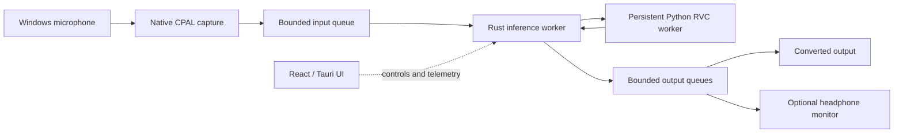

<p align="center">
  
</p>

<h1 align="center">VC Next</h1>

<p align="center">
  A Windows-first, local AI voice studio built for real-time RVC conversion.
</p>

<p align="center">
  
  
  
  
  
</p>

> [!IMPORTANT]
> VC Next is an engineering alpha. It is usable for local development and model testing, but there is no signed installer, bundled virtual microphone, or guaranteed hardware compatibility yet.

VC Next is a new application architecture—not a reskin or permanent fork of w-okada. It keeps compatibility with common RVC checkpoints while replacing the browser-owned audio loop, local Socket.IO/base64 transport, and tightly coupled UI state with a native desktop pipeline.

## Why VC Next exists

The project is built around four practical goals:

1. **A real desktop experience.** A compact voice-studio interface with clear model, audio, and engine state.
2. **A native audio path.** Capture, inference scheduling, playback, monitoring, and recovery stay outside the browser UI thread.
3. **Existing RVC compatibility.** Import familiar `.pth` checkpoints and optional FAISS `.index` files instead of requiring a new model ecosystem.
4. **Measurable performance.** Expose queue depth, xruns, inference timing, worker health, and recovery state rather than presenting unverified latency claims.

## Current capabilities

| Area | Available now |
| --- | --- |
| Desktop | Tauri 2 host with a React 19 and TypeScript interface |
| Audio | Native Windows input, converted output, and optional headphone monitor routes |
| Models | RVC v1/v2 PyTorch checkpoints with 32, 40, or 48 kHz generator output |
| Library | Persistent local model entries with custom names, search, rename, and safe removal |
| Retrieval | Optional paired FAISS `.index` loading with dimension validation |
| Features | ContentVec encoding and RMVPE pitch extraction through ONNX Runtime |
| Controls | Pitch ±50 semitones, retrieval strength, protect ratio, speaker ID, RMVPE threshold, Chunk, and Extra/context |
| Streaming | Quality, Balanced, and Low-latency presets plus explicit custom stream geometry |
| Stability | Adaptive playback priming, bounded clock-drift correction, underrun recovery, and supervised Python-worker restart |
| Privacy | Local standard-I/O transport; no inference server or cloud audio upload |
| Diagnostics | Per-stage inference timing, buffer health, worker restarts, clock corrections, peaks, and xruns |

### What is not included yet

- A signed Windows installer or automatic updater
- A built-in virtual microphone driver
- Model training or dataset preparation
- macOS, Linux, AMD, or Intel GPU support
- A finished ONNX RVC live backend
- Physical-loopback latency certification or multi-hour converted-audio soak results

See [Prototype targets](docs/prototype-targets.md) for the measured milestones and remaining acceptance work.

## How it works



The React interface never owns the real-time loop. Rust owns audio callbacks and bounded queues; Python owns model compatibility and CUDA inference. Control messages use JSON, while live mono PCM uses a framed float32 binary protocol over local standard input/output.

[Read the complete architecture guide →](docs/architecture.md)

## Reference development target

The current baseline has been exercised on:

| Component | Reference |
| --- | --- |
| Operating system | Windows 11 |
| GPU | NVIDIA GeForce RTX 4050 Laptop GPU |
| VRAM | 6 GB |
| Python | 3.11 |
| PyTorch | 2.9.0 + CUDA 12.8 |
| ONNX Runtime GPU | 1.26.0 |
| Model formats tested | RVC v1/v2, 32/40/48 kHz, optional FAISS indexes |

Other configurations may work, but they are not yet part of the compatibility promise.

## Getting started

### 1. Install prerequisites

You need:

- Windows 10 or 11
- An NVIDIA GPU with a compatible driver
- Node.js LTS and npm
- Python 3.11
- Rust with the stable MSVC toolchain
- Microsoft C++ Build Tools with **Desktop development with C++**
- Microsoft Edge WebView2

The official [Tauri prerequisites guide](https://v2.tauri.app/start/prerequisites/) covers the Windows C++ tools, WebView2, Rust, and Node requirements.

### 2. Install frontend dependencies

From the repository root:

```powershell
npm install
```

### 3. Create the Python RVC environment

```powershell
py -3.11 -m venv engine-python/.venv
.\engine-python\.venv\Scripts\python.exe -m pip install --upgrade pip
.\engine-python\.venv\Scripts\python.exe -m pip install -e engine-python
.\engine-python\.venv\Scripts\python.exe -m pip install -r engine-python\requirements-rvc-core.txt
.\engine-python\.venv\Scripts\python.exe -m pip install torch==2.9.0 torchaudio==2.9.0 --index-url https://download.pytorch.org/whl/cu128
.\engine-python\.venv\Scripts\python.exe -m pip install -r engine-python\requirements-rvc-optional.txt
```

The pinned CUDA versions are the verified project baseline, not a universal recommendation. If your driver or GPU requires another PyTorch build, use the official [PyTorch installation selector](https://pytorch.org/get-started/locally/) and validate it with the runtime probe.

### 4. Run the desktop app

```powershell
npm run tauri dev
```

For UI-only work, run the browser preview:

```powershell
npm run dev
```

> [!NOTE]
> The browser preview uses placeholder devices. Native audio, model loading, and CUDA inference are available only in the Tauri desktop host.

## Loading a voice

1. Select **Import a voice model** to open **Add model package**.
2. In **Checkpoint**, choose the required RVC `.pth` file. VC Next inspects it locally and lists detected sibling indexes.
3. In **Retrieval index**, use the recommended `.index`, choose another file, or select **Use none**.
4. In **ContentVec embedder**, choose an explicit `.onnx` file or leave auto-discovery enabled.
5. Give the voice a display name and select **Add model**.
6. Select the imported voice and press **Load voice**.
7. Wait for **Loaded and warmed** before starting audio.

Imported entries and the last selection persist locally. The model menu can rename an entry or remove it from the library without deleting its checkpoint or index from disk. RVC `.onnx` live inference remains preview-only and is not accepted by the package importer.

VC Next looks for these feature assets above or beside the selected model:

```text
Voice Changer/
├── main/
│   ├── model_dir/
│   │   └── <slot>/
│   │       ├── voice.pth
│   │       └── voice.index
│   └── modules/
│       ├── contentvec/contentvec-f.onnx
│       └── rmvpe/rmvpe_20231006.onnx
└── voice model/
    └── <other voices>/
```

The checkpoint and feature models are never committed to this repository.

## Routing live audio

VC Next exposes three device routes:

| Route | Purpose |
| --- | --- |
| **Microphone** | Physical or virtual capture device feeding the converter |
| **Output** | Converted signal intended for VoiceMeeter, a virtual cable, Discord, OBS, or another application |
| **Monitor** | Optional headphone playback for hearing the converted voice locally |

> [!WARNING]
> Use headphones when monitoring. Routing the converted output back into speakers near the active microphone can create loud acoustic feedback.

The selected devices must currently report the same default Windows sample rate. A built-in virtual microphone is planned; for now, use an existing virtual cable or VoiceMeeter route.

## Voice and streaming controls

| Control | Range | Effect |
| --- | ---: | --- |
| Pitch | −50 to +50 semitones | Shifts the source F0 before synthesis |
| Index retrieval | 0–100% | Blends neighbors from the selected FAISS index |
| Protect ratio | 0–50% | Preserves unvoiced consonants from retrieval artifacts |
| RMVPE threshold | 0.01–0.20 | Adjusts voiced/unvoiced pitch detection |
| Speaker | Model-defined | Selects a speaker embedding in multi-speaker checkpoints |
| Chunk | 3,072–52,800 frames in the UI | Controls how often the live model receives a new hop |
| Extra/context | 3,840–480,000 frames in the UI | Controls retained analysis context; safety minimums are enforced |

Smaller chunks reduce response time but leave less inference headroom and may weaken pitch stability or chunk stitching. Larger context can improve continuity at the cost of latency and compute.

## Validation

Run the same checks used for the current checkpoint:

```powershell
npm run build
cargo test --manifest-path src-tauri\Cargo.toml
.\engine-python\.venv\Scripts\python.exe -m unittest discover -s engine-python\tests -p "test_*.py" -v
```

The committed checkpoint currently passes 19 Rust tests and 29 Python tests.

## Documentation

Start with the [documentation index](docs/README.md), or jump directly to:

| Guide | Focus |
| --- | --- |
| [Architecture](docs/architecture.md) | Process boundaries, data flow, threading, commands, and failure handling |
| [Python sidecar](docs/python-sidecar.md) | Runtime setup, protocols, security policy, and model lifecycle |
| [Native audio](docs/native-audio-spike.md) | Device routing, real-time rules, adaptive playback, and telemetry |
| [Offline RVC proof](docs/offline-rvc-spike.md) | Compatibility pipeline and historical reference measurements |
| [Live RVC proof](docs/live-rvc-spike.md) | Persistent streaming design, presets, retrieval, and recovery |
| [Targets and roadmap](docs/prototype-targets.md) | Completed milestones, acceptance criteria, and next work |
| [Upstream assessment](docs/upstream-assessment.md) | w-okada reuse boundary, provenance, and licensing policy |

## Relationship to w-okada

VC Next uses a hybrid strategy:

- w-okada remains a reference for model compatibility and behavior.
- A minimal, provenance-tracked MIT RVC generator compatibility subset is retained under `engine-python/vc_next_sidecar/rvc_compat`.
- The desktop UI, native audio core, streaming transport, recovery logic, diagnostics, and application state are implemented for VC Next.
- Proprietary models and separately licensed engine families are not redistributed.

See [Upstream assessment](docs/upstream-assessment.md) and [RVC compatibility provenance](engine-python/vc_next_sidecar/rvc_compat/PROVENANCE.md) before adapting additional upstream code.

## Project status

VC Next is under active development. The next engineering focus is physical loopback measurement, extended converted-audio soak testing, continuous device-rate correction where needed, and smaller stable streaming hops.

If you are testing the alpha, useful reports include your Windows version, GPU and driver, model target rate, selected Chunk/Extra values, device routes, exported diagnostics, and whether the failure occurs during import, warm-up, or live audio.
