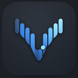
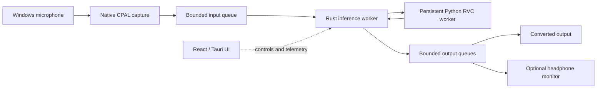

<p align="center">
  
</p>

<h1 align="center">VC Next</h1>

<p align="center">
  A Windows-first, local AI voice studio built for real-time RVC conversion.
</p>

<p align="center">
  
  
  
  
  
</p>

> [!IMPORTANT]
> VC Next is an engineering alpha. It is usable for local development and model testing, but there is no signed installer, bundled virtual microphone, or guaranteed hardware compatibility yet.

VC Next is a new application architecture—not a reskin or permanent fork of w-okada. It keeps compatibility with common RVC checkpoints while replacing the browser-owned audio loop, local Socket.IO/base64 transport, and tightly coupled UI state with a native desktop pipeline.

## Why VC Next exists

The project is built around four practical goals:

1. **A real desktop experience.** A compact voice-studio interface with clear model, audio, and engine state.
2. **A native audio path.** Capture, inference scheduling, playback, monitoring, and recovery stay outside the browser UI thread.
3. **Existing RVC compatibility.** Import familiar `.pth` checkpoints and optional FAISS `.index` files instead of requiring a new model ecosystem.
4. **Measurable performance.** Expose queue depth, xruns, inference timing, worker health, and recovery state rather than presenting unverified latency claims.

## Current capabilities

| Area | Available now |
| --- | --- |
| Desktop | Tauri 2 host with a React 19 and TypeScript interface |
| Audio | Native Windows input, converted output, and optional headphone monitor routes |
| Models | RVC v1/v2 PyTorch checkpoints and exported five-input ONNX generators, with 32, 40, or 48 kHz generator output |
| Library | Persistent local model entries with custom names, search, rename, and safe removal |
| Retrieval | Optional paired FAISS `.index` loading with dimension validation |
| Features | ContentVec encoding and RMVPE pitch extraction through ONNX Runtime |
| Controls | Pitch ±50 semitones, retrieval strength, protect ratio, speaker ID, RMVPE threshold, Chunk, and Extra/context |
| Streaming | Quality, Balanced, and Low-latency presets plus explicit custom stream geometry |
| Stability | Adaptive playback priming, bounded clock-drift correction, underrun recovery, device-loss detection, and supervised Python-worker restart |
| Input cleanup | Optional high-pass/DC blocking, adaptive noise suppression, noise gate, limiter, and conservative far-end echo control |
| Calibration | Per-model Quality/Balanced/Low-latency measurements with recommended Chunk/Extra settings |
| Privacy | Local standard-I/O transport; no inference server or cloud audio upload |
| Diagnostics | Per-stage inference timing, buffer health, worker restarts, clock corrections, peaks, and xruns |
| Release path | Reproducible optimized Tauri MSI/NSIS bundles with staged engine resources; production signing and dependency bootstrap remain separate |

### What is not included yet

- A signed Windows installer or automatic updater
- A built-in virtual microphone driver
- Model training or dataset preparation
- macOS, Linux, AMD, or Intel GPU support
- Broader ONNX generator coverage and CUDA performance certification across exported model variants
- Physical-loopback latency certification or multi-hour converted-audio soak results
- Full WebRTC/RNNoise-class acoustic echo cancellation; the current echo control is intentionally lightweight and safe for real-time callbacks

See [Prototype targets](docs/prototype-targets.md) for the measured milestones and remaining acceptance work.

## How it works



The React interface never owns the real-time loop. Rust owns audio callbacks and bounded queues; Python owns model compatibility and CUDA inference. Control messages use JSON, while live mono PCM uses a framed float32 binary protocol over local standard input/output.

[Read the complete architecture guide →](docs/architecture.md)

## Reference development target

The current baseline has been exercised on:

| Component | Reference |
| --- | --- |
| Operating system | Windows 11 |
| GPU | NVIDIA GeForce RTX 4050 Laptop GPU |
| VRAM | 6 GB |
| Python | 3.11 |
| PyTorch | 2.9.0 + CUDA 12.8 |
| ONNX Runtime GPU | 1.26.0 |
| Model formats tested | RVC v1/v2, 32/40/48 kHz, optional FAISS indexes |

Other configurations may work, but they are not yet part of the compatibility promise.

## Getting started

### 1. Install prerequisites

You need:

- Windows 10 or 11
- An NVIDIA GPU with a compatible driver
- Node.js LTS and npm
- Python 3.11
- Rust with the stable MSVC toolchain
- Microsoft C++ Build Tools with **Desktop development with C++**
- Microsoft Edge WebView2

The official [Tauri prerequisites guide](https://v2.tauri.app/start/prerequisites/) covers the Windows C++ tools, WebView2, Rust, and Node requirements.

### 2. Install frontend dependencies

From the repository root:

```powershell
npm install
```

### 3. Create the Python RVC environment

The automated path installs the verified Python 3.11, PyTorch CUDA 12.8, ONNX Runtime GPU, FAISS, and sidecar dependencies:

```powershell
npm run runtime:setup
```

Use `-SkipTorch` when PyTorch is already installed, `-SkipOptional` to inspect a partial environment without installing ONNX Runtime GPU, or `-ForceRecreate` to rebuild the project virtual environment. The script ends with the same runtime probe used by the desktop app and exits non-zero if RVC is not ready.

For manual control:

```powershell
py -3.11 -m venv engine-python/.venv
.\engine-python\.venv\Scripts\python.exe -m pip install --upgrade pip
.\engine-python\.venv\Scripts\python.exe -m pip install -e engine-python
.\engine-python\.venv\Scripts\python.exe -m pip install -r engine-python\requirements-rvc-core.txt
.\engine-python\.venv\Scripts\python.exe -m pip install torch==2.9.0 torchaudio==2.9.0 --index-url https://download.pytorch.org/whl/cu128
.\engine-python\.venv\Scripts\python.exe -m pip install -r engine-python\requirements-rvc-optional.txt
```

The pinned CUDA versions are the verified project baseline, not a universal recommendation. If your driver or GPU requires another PyTorch build, use the official [PyTorch installation selector](https://pytorch.org/get-started/locally/) and validate it with the runtime probe.

### 4. Run the desktop app

```powershell
npm run tauri dev
```

For UI-only work, run the browser preview:

```powershell
npm run dev
```

> [!NOTE]
> The browser preview uses placeholder devices. Native audio, model loading, and CUDA inference are available only in the Tauri desktop host.

## Loading a voice

1. Select **Import a voice model** to open **Add model package**.
2. In **Checkpoint / ONNX model**, choose the RVC `.pth` checkpoint or exported five-input `.onnx` generator. VC Next inspects it locally and lists detected sibling indexes. If you have a w-okada `model` or `model_dir` folder, use **Choose folder**; VC Next scans a bounded package depth and lets you pick the checkpoint it found.
3. In **Retrieval index**, use the recommended `.index`, choose another file, or select **Use none**.
4. In **ContentVec embedder**, choose an explicit `.onnx` file or leave auto-discovery enabled.
5. Give the voice a display name and select **Add model**.
6. Select the imported voice and press **Load voice**.
7. Wait for **Loaded and warmed** before starting audio.

Imported entries and the last selection persist locally. The model menu can rename an entry or remove it from the library without deleting its checkpoint or index from disk. Exported five-input RVC `.onnx` generators can be loaded when their ContentVec/RMVPE assets are available; models with unusual signatures still require compatibility validation.

### Keeping a w-okada voice sounding like the original

When the selected checkpoint is beside a w-okada `params.json`, VC Next imports its safe, model-specific defaults during inspection. This includes pitch shift, retrieval-index ratio, Protect ratio, Chunk, the recommended sibling `.index`, and the requested Hubert embedder. Explicit controls in the app still override those defaults.

For example, a package with `pitch_shift: 14`, `index_ratio: 0.30`,
`protect_ratio: 0.50`, `chunk_sec: 0.5`, and `embedder: "hubert_base_l12"`
will load with the corresponding VC Next values and prefer w-okada's canonical
`contentvec/contentvec-f.onnx` asset when it is available. The package dialog
shows **w-okada settings imported** when metadata was found. Older library
entries are inspected once at load time and migrated when they still contain
the original prototype defaults.

If the package has no metadata, VC Next keeps its normal neutral defaults. You
can always choose another `.index`, embedder, pitch, retrieval ratio, Protect
ratio, Chunk, or Extra/context value from the advanced controls.

For parity with the current w-okada RVC path, the live worker uses nearest
neighbor retrieval (`k=1`) by default, applies the same two-stage Protect mask,
and scales generated speech using the source crop's `sqrt(RMS)` volume rule.
These details matter when comparing the same `.pth` + `.index` pair across
hosts; they are separate from the optional native noise-suppression controls.
The feature-rate boundary uses the same `resampy` `kaiser_fast` filter as
w-okada's RVCv2 implementation; the worker reports whether that exact package
is installed and uses a matching Kaiser torchaudio fallback during partial
runtime setup.

### Idle-input silence protection

The persistent worker measures each incoming hop before running RVC. Frames at
or below the conservative `0.002` RMS floor are returned as exact zeros when
fewer than 2% of samples show concentrated activity, so isolated peaks do not
wake the decoder while a short quiet syllable can still pass. This matters for
Voicemeeter and USB interfaces whose idle floor has occasional spikes. The
native route repeats the decision at the complete live-block boundary with a
slightly higher `0.004` RMS backstop (about -48 dBFS), clearing queued output
during startup or worker recovery when a virtual-device floor is above the
Python threshold. Stream history is reset
when speech resumes so the first voiced hop does not inherit a stale SOLA tail.
Warm-up and calibration explicitly bypass this gate so their timing
measurements still represent real inference.

VC Next looks for these feature assets above or beside the selected model:

```text
Voice Changer/
├── main/
│   ├── model_dir/
│   │   └── <slot>/
│   │       ├── voice.pth
│   │       └── voice.index
│   └── modules/
│       ├── contentvec/contentvec-f.onnx
│       └── rmvpe/rmvpe_20231006.onnx
└── voice model/
    └── <other voices>/
```

The checkpoint and feature models are never committed to this repository.

The Tauri installer maps the staged module to an `engine-python` resource beside
the desktop executable, so the packaged app can discover the sidecar module
without a project checkout. For a portable or relocated build, set
`VC_NEXT_ENGINE_DIR` to the folder containing `vc_next_sidecar`. The resolver
also searches the project, executable, `resources`, and current-directory
locations in that order.

## Routing live audio

VC Next exposes three device routes:

| Route | Purpose |
| --- | --- |
| **Microphone** | Physical or virtual capture device feeding the converter |
| **Output** | Converted signal intended for VoiceMeeter, a virtual cable, Discord, OBS, or another application |
| **Monitor** | Optional headphone playback for hearing the converted voice locally |

> [!WARNING]
> Use headphones when monitoring. Routing the converted output back into speakers near the active microphone can create loud acoustic feedback.

The native path keeps the RVC model contract at 48 kHz and resamples input/output/monitor endpoints when their Windows defaults differ. A built-in virtual microphone is planned; for now, use an existing virtual cable or VoiceMeeter route.

While audio is running, VC Next checks the selected endpoints periodically. If Windows removes a microphone, output, or monitor device, the session stays visible and offers **Restart audio** after the endpoint returns instead of silently switching to a different device.

## Voice and streaming controls

| Control | Range | Effect |
| --- | ---: | --- |
| Pitch | −50 to +50 semitones | Shifts the source F0 before synthesis |
| Index retrieval | 0–100% | Blends neighbors from the selected FAISS index |
| Protect ratio | 0–50% | Preserves unvoiced consonants from retrieval artifacts |
| RMVPE threshold | 0.01–0.99 (default 0.30) | Adjusts voiced/unvoiced pitch detection; 0.30 matches w-okada's RMVPE ONNX default |
| Speaker | Model-defined | Selects a speaker embedding in multi-speaker checkpoints |
| Chunk | 3,072–52,800 frames in the UI | Controls how often the live model receives a new hop |
| Extra/context | 3,840–480,000 frames in the UI | Controls retained analysis context; safety minimums are enforced |

Smaller chunks reduce response time but leave less inference headroom and may weaken pitch stability or chunk stitching. Larger context can improve continuity at the cost of latency and compute.

## Validation

Run the same checks used for the current checkpoint:

```powershell
npm run build
cargo test --manifest-path src-tauri\Cargo.toml
.\engine-python\.venv\Scripts\python.exe -m unittest discover -s engine-python\tests -p "test_*.py" -v
```

The current working tree passes 32 Rust library tests, 29 native-route tests,
62 Python tests, and the TypeScript/Vite production build. The runtime probe
checks PyTorch CUDA and the ONNX Runtime CUDA provider before reporting RVC
readiness, while the desktop diagnostics use a native NVIDIA/Windows GPU probe
instead of assuming the development machine. A native Tauri bundle still
requires the debug app to be closed before packaging because Windows locks the
running executable.

To validate a real `.pth` + `.index` pair without opening the UI, use the framed-worker smoke test:

```powershell
.\engine-python\.venv\Scripts\python.exe engine-python\tools\live_worker_smoke.py `
  --model "C:\path\to\voice.pth" `
  --index "C:\path\to\voice.index" `
  --index-ratio 0.5 `
  --streaming-preset balanced `
  --chunks 3 `
  --output outputs\voice-smoke.wav
```

It verifies the worker handshake, feature discovery, paired index load, finite PCM output, stream priming, and whether measured processing stays under the selected Chunk deadline.

To test the exact package metadata path and idle-input gate, omit the manual
tuning fields and add `--use-package-defaults`:

```powershell
.\engine-python\.venv\Scripts\python.exe engine-python\tools\live_worker_smoke.py `
  --model "C:\path\to\voice.pth" `
  --use-package-defaults --chunks 3
```

The status reports the effective pitch/index/Protect/Chunk/embedder values and
`silenceSuppressedCalls`; an empty input should report a zero output peak.
The desktop engine also exposes `inferenceSilenceSuppressedCalls`, which counts
complete live blocks rejected by the native backstop before they reach the
Python worker. This makes virtual-device noise protection visible in the same
diagnostics panel as inference timing and XRuns.
Pass `--contentvec C:\path\to\contentvec-f.onnx` (or `--rmvpe ...`) when
comparing feature assets explicitly; otherwise the worker follows the package
layout and w-okada-compatible resolver.

To run the runtime probe and real-model smoke as one reproducible report:

```powershell
npm run validate:reference -- `
  -ModelPath "C:\path\to\voice.pth" `
  -IndexPath "C:\path\to\voice.index" `
  -SkipAudio
```

Add `-InputDevice`, `-OutputDevice`, and `-AudioSeconds 30` to include the endpoint loopback measurement. For an acceptance run, add `-ImpulseCount 100`; the harness extends the capture window as needed, requires all requested impulses to be detected, and fails the report if any are missing. The generated report keeps model and device basenames rather than full local paths.

The same command can include a real converted duplex route by adding
`-ConvertedInputDevice`, `-ConvertedOutputDevice`, and
`-ConvertedRouteSeconds 60`. Add `-ConvertedRouteStrict` to fail on callback
warnings, queue drops, output underruns, or worker deadline misses. The result
is stored under `convertedRoute` in the combined report.

The same command can include a converted-worker soak with `-SoakSeconds 60` (use `7200` for a two-hour simulated audio run). Add `-SoakRealtime` when the acceptance run must pace requests to real time; without it, the worker runs as fast as the GPU allows. It records the soak under `convertedSoak` and fails if output is non-finite or any selected Chunk deadline is missed:

```powershell
npm run validate:reference -- `
  -ModelPath "C:\path\to\voice.pth" `
  -IndexPath "C:\path\to\voice.index" `
  -InputDevice 7 -OutputDevice 13 `
  -ImpulseCount 100 -SoakSeconds 60 -SoakRealtime
```

For the measured intermediate safety profile, add `-SoakChunkFrames 10560 -SoakExtraFrames 25920`.

For physical or virtual device validation, install the optional PortAudio wrapper and run the loopback harness:

```powershell
.\engine-python\.venv\Scripts\python.exe -m pip install -r engine-python\requirements-audio-validation.txt
.\engine-python\.venv\Scripts\python.exe engine-python\tools\audio_validation.py `
  --mode loopback --input-device "Your return device" --output-device "Your test output" `
  --seconds 30 --report outputs\loopback.json
```

Use `--mode soak --seconds 7200` for a two-hour callback stability run. The harness reports callback warnings and P50/P95/min/max detected loopback delay; it does not replace a converted-audio soak through VC Next itself.

For a converted-audio soak through the persistent RVC worker, use:

```powershell
.\engine-python\.venv\Scripts\python.exe engine-python\tools\live_worker_soak.py `
  --model "C:\path\to\voice.pth" --index "C:\path\to\voice.index" `
  --input "C:\path\to\speech.wav" --seconds 7200 `
  --realtime `
  --report outputs\live-worker-soak.json
```

The soak runner keeps timing and counters rather than retaining hours of PCM. Reports distinguish simulated audio duration from wall-clock duration. A non-zero exit means a non-finite response or at least one missed selected Chunk deadline.

For a quality comparison, record the same phrase through w-okada and VC Next,
then align the two WAV files before interpreting differences:

```powershell
.\engine-python\.venv\Scripts\python.exe engine-python\tools\compare_audio.py `
  --reference outputs\wokada.wav `
  --candidate outputs\vc-next.wav `
  --report outputs\voice-quality-comparison.json
```

The report includes best lag, aligned correlation, RMSE/MAE, gain ratio, peaks,
and silence ratios. It does not claim perceptual parity from a mismatched input,
device route, model index, pitch extractor, or Chunk/Extra configuration.

To exercise a real microphone-to-output converted route, use the opt-in duplex
harness below. It drives the same persistent RVC worker from a full-duplex
Windows callback and reports input drops, converted-output underruns, worker
deadline misses, callback warnings, and first-output latency. Use headphones or
a dummy/virtual output while testing:

```powershell
npm run validate:route -- `
  -ModelPath "C:\path\to\voice.pth" `
  -IndexPath "C:\path\to\voice.index" `
  -InputDevice "Your microphone" `
  -OutputDevice "Your VoiceMeeter or cable output" `
  -Seconds 60 -Strict
```

Add `-UsePackageDefaults` when comparing a w-okada bundle and you want the
route harness to import its `params.json` values instead of the harness's manual
pitch/index/Protect defaults.

This harness validates the converted sidecar route and its realtime budget; it
does not replace the native Rust/CPAL path or the final physical loopback
measurement. The report is written to `outputs\reference-validation\live-route-validation.json`.

To exercise the actual native Windows route used by the Tauri host, use the
native validation binary. It enumerates CPAL/WASAPI endpoints, loads the paired
checkpoint and index, starts native input/output/optional monitor streams, and
prints worker and callback telemetry:

```powershell
# List exact endpoint IDs and names.
npm run validate:native-route -- -List

# Run a five-second real-model route. Use headphones or a virtual output.
npm run validate:native-route -- `
  -ModelPath "C:\path\to\voice.pth" `
  -IndexPath "C:\path\to\voice.index" `
  -ContentVecPath "C:\path\to\contentvec-f.onnx" `
  -InputDevice "Your microphone" `
  -OutputDevice "Your VoiceMeeter or cable output" `
  -Seconds 5 -Preset quality -ReportPath outputs\native-route.json
```

The native diagnostic leaves the high-pass/DC filter off by default for
w-okada-compatible fidelity. Add `-HighPass` to exercise the optional rumble
filter; the report records both the requested and active setting.

The diagnostic defaults to the package-compatible `Pitch +14`, `Index 0.30`,
`Protect 0.50`, `Chunk 24,000`, and the effective v2 analysis window of
`33,120` frames used by the current reference voice (24,000 hop + 4,096
overlap + 576 search + w-okada's 16 kHz/160-sample conversion rounding).
Override those values when validating a different package.
For an idle source, a healthy run reports `maxOutputPeak: 0`,
`silenceSuppressedCalls > 0`, no missed deadlines, and no output underruns. A
real speech route should be evaluated separately with a recorded source and a
controlled loopback; idle silence passing does not prove perceptual quality
parity with w-okada.

On the RTX 4050 reference system, an earlier Balanced run showed occasional scheduler spikes during extended testing. After the live-worker parity and startup changes, the current 9,600-frame / 24,000-frame (200/500 ms) Balanced pair completed 600 realtime calls over 120 seconds with finite output and zero deadline misses (P50 91.2 ms, P95 105.9 ms, max 154.4 ms). The Quality 12,000-frame / 28,800-frame (250/600 ms) profile remains available when a larger safety margin is preferred. These are worker measurements; they do not replace a physical converted-speech loopback or a two-hour native-route soak.

### Operational recovery checklist

When a live session stops producing audio:

1. Check the **Session diagnostics** panel for XRuns, queue depth, and the last native error.
2. Confirm the selected microphone, output, and monitor still exist in Windows Sound settings.
3. Reconnect the endpoint or virtual cable and press **Restart audio**.
4. If conversion alone is unstable, stop audio, run **Hardware calibration**, apply the recommended profile, and start again.
5. Use **Copy report** in diagnostics when reporting a model or device-specific failure. Reports include model/settings metadata but only checkpoint basenames, not full local paths.

If the engine panel reports that the RVC runtime needs attention, choose **Run setup** in the warning. The desktop host opens the staged `setup-runtime.ps1` bootstrap in a visible PowerShell window; a source checkout gets an adjacent `.venv`, while an install under `Program Files` uses `%LOCALAPPDATA%\VC Next\engine-python\.venv`. It installs the verified dependencies and leaves the probe output available for troubleshooting. **Copy command** remains available for source checkouts (`npm run runtime:setup`). The app intentionally does not install multi-gigabyte CUDA dependencies silently.

### Release preparation

The repository does not silently copy a multi-gigabyte Python/CUDA environment into Git or an installer. Stage the Python package explicitly, then point the packaged app at the staged directory:

```powershell
npm run release:prepare
$env:VC_NEXT_ENGINE_DIR = (Resolve-Path release\engine-python).Path
npm run tauri -- build --debug
```

`npm run release:check -SkipModelSmoke` runs the frontend, Rust, Python, and CUDA/ONNX runtime checks. Add `-ModelPath` and `-IndexPath` to run the real paired-model smoke test as part of the same gate. A production installer still needs a chosen Python/CUDA distribution and code-signing policy; the preparation script makes that boundary explicit instead of producing an incomplete bundle.

The staged package includes `engine-python\setup-runtime.ps1`. After installing
VC Next, run that script from the installed `engine-python` folder if Python or
the CUDA packages are not already present. It uses the same setup logic as the
source checkout and creates a writable per-user environment when the install
directory is protected; the desktop host finds it automatically on the next
runtime check.

## Documentation

Start with the [documentation index](docs/README.md), or jump directly to:

| Guide | Focus |
| --- | --- |
| [Architecture](docs/architecture.md) | Process boundaries, data flow, threading, commands, and failure handling |
| [Python sidecar](docs/python-sidecar.md) | Runtime setup, protocols, security policy, and model lifecycle |
| [Native audio](docs/native-audio-spike.md) | Device routing, real-time rules, adaptive playback, and telemetry |
| [Offline RVC proof](docs/offline-rvc-spike.md) | Compatibility pipeline and historical reference measurements |
| [Live RVC proof](docs/live-rvc-spike.md) | Persistent streaming design, presets, retrieval, and recovery |
| [Targets and roadmap](docs/prototype-targets.md) | Completed milestones, acceptance criteria, and next work |
| [Upstream assessment](docs/upstream-assessment.md) | w-okada reuse boundary, provenance, and licensing policy |

## Relationship to w-okada

VC Next uses a hybrid strategy:

- w-okada remains a reference for model compatibility and behavior.
- A minimal, provenance-tracked MIT RVC generator compatibility subset is retained under `engine-python/vc_next_sidecar/rvc_compat`.
- The desktop UI, native audio core, streaming transport, recovery logic, diagnostics, and application state are implemented for VC Next.
- Proprietary models and separately licensed engine families are not redistributed.

See [Upstream assessment](docs/upstream-assessment.md) and [RVC compatibility provenance](engine-python/vc_next_sidecar/rvc_compat/PROVENANCE.md) before adapting additional upstream code.

## Project status

VC Next is under active development. Historical CABLE-A passthrough acceptance detected 100/100 impulses, but the current WASAPI-selected shared-rate probe returns 0/2 impulses with zero callback warnings on this machine; the app now surfaces that stalled-route condition instead of hiding it. The native route has also passed an idle real-model run with zero output peak, XRuns, or inference deadline misses. The installed release sidecar has loaded the real paired checkpoint/index on CUDA, and a 120-second realtime Balanced soak completed with zero deadline misses. Physical converted-speech certification, the two-hour acceptance matrix, signed distribution, and a built-in virtual-microphone strategy remain next.

If you are testing the alpha, useful reports include your Windows version, GPU and driver, model target rate, selected Chunk/Extra values, device routes, exported diagnostics, and whether the failure occurs during import, warm-up, or live audio.
