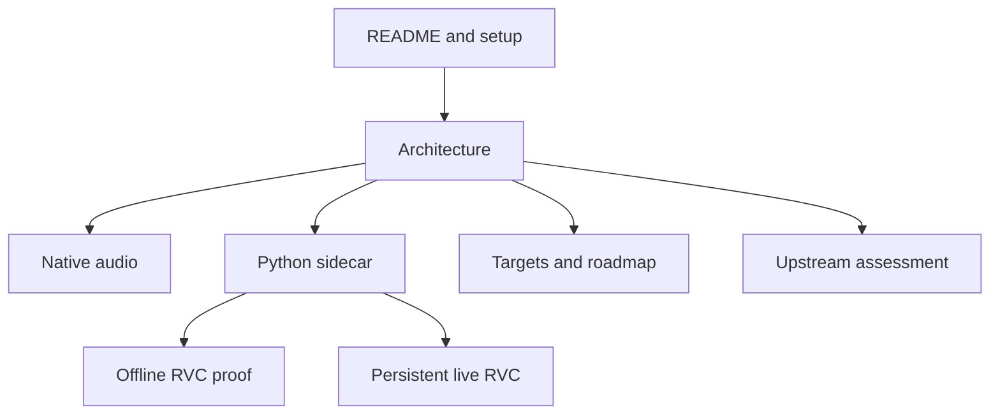

# VC Next documentation

This directory records the design, compatibility boundary, measurements, and remaining engineering work behind VC Next.

> [!TIP]
> New to the project? Read the root [README](../README.md), then continue with [Architecture](architecture.md) and [Python sidecar](python-sidecar.md).

## Documentation map

| Document | Read this when you need to understand… |
| --- | --- |
| [Architecture](architecture.md) | Process ownership, threading, transport, state transitions, commands, and recovery |
| [Python sidecar](python-sidecar.md) | Environment setup, model inspection, worker protocols, and the checkpoint security boundary |
| [Native audio spike](native-audio-spike.md) | WASAPI/CPAL routing, queues, monitoring, adaptive playback, clock correction, and audio telemetry |
| [Offline RVC spike](offline-rvc-spike.md) | How the first end-to-end model compatibility proof was produced and measured |
| [Persistent live RVC spike](live-rvc-spike.md) | Resident model lifecycle, stream geometry, FAISS retrieval, SOLA, deadlines, and restart behavior |
| [Prototype targets](prototype-targets.md) | What is complete, what remains experimental, and how future milestones will be accepted |
| [Upstream assessment](upstream-assessment.md) | Which w-okada concepts or files are reusable, replaced, or excluded |
| [RVC provenance](../engine-python/vc_next_sidecar/rvc_compat/PROVENANCE.md) | Exact imported paths, upstream commit, notices, and local modifications |

## Status vocabulary

The documentation uses the following terms deliberately:

| Term | Meaning |
| --- | --- |
| **Implemented** | Present in the current source tree and exercised by automated or targeted tests |
| **Verified** | Run successfully on the Windows 11 / RTX 4050 reference system |
| **Measured** | Captured from a described fixture; not a universal performance guarantee |
| **Target** | A desired result that has not yet been proven by the required measurement |
| **Deferred** | Intentionally outside the current milestone |

## Current system boundary

VC Next is split into three layers:

1. **React/TypeScript** renders controls and diagnostics.
2. **Rust/Tauri** owns application lifecycle, Windows audio, queues, telemetry, and worker supervision.
3. **Python** owns legacy RVC model compatibility, ContentVec, RMVPE, FAISS retrieval, and PyTorch CUDA inference.

Audio remains local. The Python worker is a subprocess connected through standard input/output; it does not listen on a TCP port.

## Keeping the docs accurate

When an implementation changes, update the matching document and follow these rules:

- Never describe inferred model time as measured end-to-end latency.
- Include the model, hardware, stream geometry, sample rate, and run count beside benchmark values.
- Mark historical spike measurements as historical after the implementation evolves.
- Keep checkpoint files, indexes, feature models, recordings, and other user assets out of the repository.
- Record the provenance and license of adapted compatibility code before committing it.
- Prefer actionable limitations and recovery steps over vague warnings.
