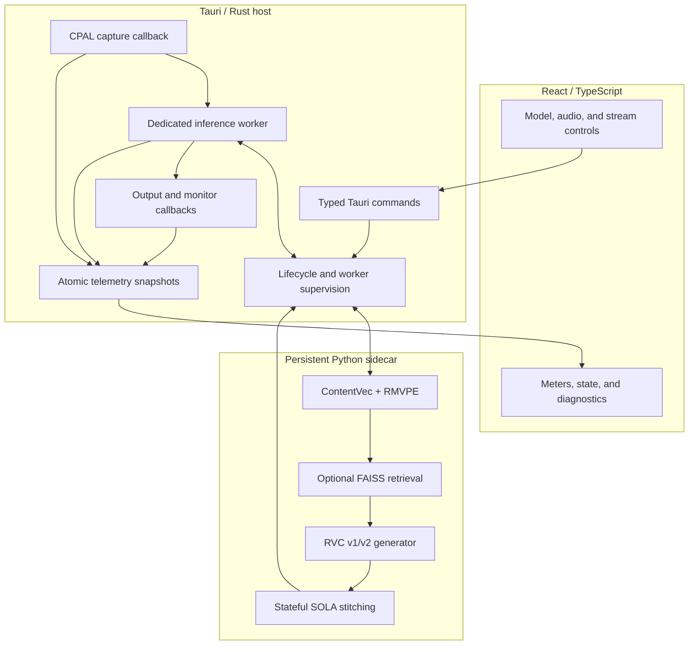
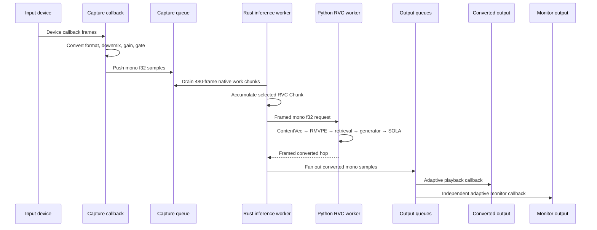
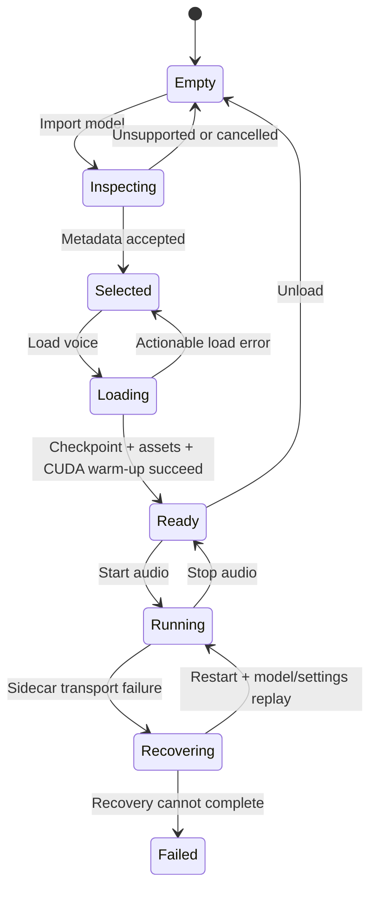

# Architecture

VC Next separates presentation, real-time audio, and RVC compatibility so that a slow UI render, model load, or Python failure cannot run inside a Windows audio callback.

[← Documentation index](README.md)

## Design principles

| Principle | Architectural consequence |
| --- | --- |
| Keep the UI outside the audio loop | React sends commands and renders snapshots; it never captures or transforms PCM |
| Keep callbacks bounded | Capture and playback callbacks use preallocated queues and small numeric operations only |
| Keep compatibility replaceable | Python RVC support sits behind a Rust inference interface |
| Keep local transport local | Rust and Python communicate over standard input/output, not HTTP or WebSockets |
| Make failure visible | Worker health, queue state, xruns, recovery, and timing are surfaced to the UI |
| Separate targets from measurements | Model timing, inferred buffering, and physical loopback latency are reported as different quantities |

## System overview

## Layer responsibilities

### React and TypeScript

The frontend in `src/` owns:

- persistent model-library presentation, search, rename/removal, and native file-picker orchestration;
- input, output, and monitor device selection;
- model settings and local preference persistence;
- loading, running, recovery, and error states;
- meters, queue diagnostics, worker health, and benchmark labels;
- browser-preview fallbacks for UI development.

The browser preview intentionally reports placeholder devices. It does not claim to capture native audio or run CUDA inference.

### Tauri and Rust

The native host in `src-tauri/src/` owns:

- WASAPI device enumeration through CPAL;
- capture, converted output, and optional monitor streams;
- fixed-capacity queues between real-time stages;
- gain, noise gate, mono downmix, and channel fan-out;
- inference-worker scheduling and deadline telemetry;
- the Python process and its framed standard-I/O transport;
- model load/unload coordination while audio is stopped;
- worker timeout, restart, model replay, and settings replay;
- converting native state into typed frontend command responses.

### Python compatibility engine

The `engine-python/` package owns:

- dependency and CUDA capability probing;
- safe first-pass model metadata inspection;
- restricted weights-only trusted-checkpoint validation;
- RVC v1/v2 generator construction;
- ContentVec and RMVPE ONNX sessions;
- optional FAISS index validation and retrieval;
- 32/40/48 kHz generator output normalization to the 48 kHz live path;
- custom Chunk/Extra geometry and stateful SOLA stitching;
- offline conversion and the persistent live worker.

## Live audio data path

The audio callbacks do not call Python, touch the filesystem, load models, log strings, or wait for inference. When a converted sample is unavailable, playback produces silence and increments telemetry instead of blocking.

## Queue and clock model

The input, converted-output, and monitor routes use bounded `ArrayQueue<f32>` buffers. Bounded queues prevent an unhealthy consumer from creating unbounded latency or memory growth.

Output and monitor devices have independent hardware clocks. Each route therefore owns an `AdaptivePlayback` controller that:

1. primes to a bounded safety depth before playback begins;
2. increases that target after an underrun;
3. settles toward the lower target after a stable interval;
4. performs bounded drop/repeat correction when queue depth drifts;
5. reports reprimes and clock corrections separately for output and monitor.

The native boundary also contains bounded stateful linear resamplers: endpoint input is converted to the fixed 48 kHz inference contract, while converted output and monitor samples are converted to each device's native rate. This is deliberately conservative for real-time safety; higher-order quality and long-session drift measurements remain open work.

The monitor route is optional at startup. A Windows endpoint can be unavailable
even while its device entry remains enumerated (for example, when another
application owns it or its shared format changes). In that case the native
host keeps capture and converted output running, disables only the monitor
callback, and exposes the bounded failure through `lastError` instead of
turning a monitor problem into a full-session startup failure.

The desktop status layer also distinguishes an idle microphone from a stalled
output route. After capture has started, an active input peak with no
corresponding output peak raises a recovery action instead of leaving the
session looking healthy. This is intentionally explicit because virtual cable
endpoints can remain enumerated while their graph is disconnected.

## Inference interface

`src-tauri/src/inference.rs` defines a backend-neutral contract with the following lifecycle:

- `prepare(config)` validates sample rate and worker chunk constraints;
- `process(input, output)` consumes a native chunk without blocking callbacks;
- `reset()` clears streaming state;
- `capabilities()` describes backend identity and statefulness.

Two implementations currently sit behind the contract:

| Backend | Behavior |
| --- | --- |
| No-op/passthrough | Copies the native signal when no voice is resident |
| Live RVC | Accumulates native frames, submits asynchronous Python work, and drains converted output |

The seam allows a future native ONNX, TensorRT, or causal model backend without rebuilding the UI or audio device layer.

## Model lifecycle

Model loading is permitted only while audio is stopped. This prevents a partially constructed generator or changed streaming shape from entering an active audio session.

### Import and validation passes

The import workflow deliberately separates cheap inspection from trusted loading:

1. The first pass reads file path, extension, size, container hints, and sibling `.index` paths without deserializing a checkpoint.
2. A trusted `.pth` pass uses PyTorch's weights-only loader.
3. The checkpoint schema, config length, RVC version, target rate, pitch flag, speakers, and state-dictionary keys are validated.
4. The generator and feature sessions are built.
5. A silent inference pass warms CUDA before the model becomes **Ready**.

## Rust ↔ Python transport

VC Next uses two standard-I/O protocols:

| Protocol | Purpose | Encoding |
| --- | --- | --- |
| One-shot control | Runtime and model inspection | Versioned JSON line |
| Persistent live worker | Lifecycle controls and live PCM | 16-byte framed header + JSON or binary f32 payload |

The live frame header contains protocol magic, frame kind, request ID, and payload length. Both sides validate payload size and response identity. No localhost port is opened.

### Worker supervision

Rust places control and audio work on a bounded I/O thread. Requests have explicit deadlines: model loading receives a longer timeout than ordinary controls or audio. If the pipe closes or a request fails:

1. worker health changes to **Recovering**;
2. the sidecar process is restarted;
3. the last successful model-load parameters are replayed;
4. the latest settings are merged and replayed;
5. the interrupted request is retried once;
6. health returns to **Healthy** or becomes **Failed** with the retained cause.

During recovery, the native pipeline remains alive and safely emits silence where converted samples are unavailable.

## Tauri command surface

| Command | Purpose | Important constraint |
| --- | --- | --- |
| `get_system_profile` | Reports the Windows/GPU reference profile | Diagnostic only |
| `get_audio_devices` | Enumerates active input and output endpoints | Runs off the UI thread |
| `start_audio_engine` | Starts capture, inference, output, and optional monitor | Native boundary resamples endpoint rates to the fixed 48 kHz live path |
| `get_audio_engine_status` | Returns peaks, queue depth, xruns, timings, and corrections | Snapshot; does not block callbacks |
| `stop_audio_engine` | Deterministically drops the native streams | Safe to call repeatedly |
| `probe_inference_runtime` | Checks Python, packages, Torch, and CUDA | Runs in the project-local environment |
| `inspect_rvc_model` | Performs metadata-only inspection | Does not deserialize `.pth` |
| `discover_rvc_models` | Scans a selected w-okada/model folder for importable `.pth` and generator `.onnx` files | Bounded depth; skips symlinks and known feature-extractor ONNX assets |
| `inspect_trusted_rvc_checkpoint` | Validates a trusted checkpoint with weights-only loading | `.pth` compatibility path |
| `load_live_rvc_model` | Loads assets, validates settings, and warms CUDA | Audio must be stopped |
| `set_live_rvc_settings` | Applies pitch, retrieval, protection, speaker, F0, and stream geometry | Used before the next session |
| `get_live_rvc_status` | Reports resident model and worker telemetry | Includes recovery state |
| `unload_live_rvc_model` | Releases the model session | Audio must be stopped |

Slow native calls are dispatched through Tauri's blocking worker pool, allowing the application window to keep rendering during discovery and model warm-up.

## Settings flow

Model settings are keyed locally by model path. The settings contract includes:

- checkpoint and optional index/embedder paths;
- pitch shift;
- index and protect ratios;
- speaker ID;
- RMVPE threshold;
- named streaming preset;
- explicit Chunk and Extra/context frames.

Changing Quality, Balanced, or Low latency updates the preset geometry. Advanced Chunk/Extra selectors can then override the hop and analysis context. Python clamps the analysis window to a stitch-safe minimum.

## Security and privacy boundary

- Live PCM remains on the local machine.
- The Python process does not expose HTTP, WebSocket, or Socket.IO endpoints.
- Initial import does not call unrestricted `torch.load`.
- Trusted loading uses `weights_only=True` and strict structural validation.
- Model files, FAISS indexes, feature models, and recordings are not redistributed.
- Upstream-derived compatibility files retain provenance and license notices.

This reduces risk but does not turn untrusted model files into guaranteed-safe content. Only load checkpoints from sources you trust.

## Known architectural limits

- Windows/NVIDIA is the only reference target.
- Endpoint rates can differ; the native boundary resamples them to the fixed 48 kHz live path. Higher-order resampler QA is still pending.
- CPAL uses shared-mode device defaults rather than an exclusive/event-driven tuning pass.
- Exported five-input RVC `.onnx` generators are connected to live inference; CUDA provider coverage and low-latency certification remain model-dependent.
- The first converted block is silent while overlap state and output queues prime.
- Model-library metadata is local to the current Windows profile and is not yet portable between machines.
- A CABLE-A passthrough baseline has zero callback warnings; the latest exact-count run detected 100/100 impulses and measured 247.7 ms P50/P95. The native route has also passed an idle paired-model run with zero output peak and zero XRuns, while a 120-second realtime worker soak completed with zero deadline misses. Physical converted-speech latency and long native-route certification remain pending.

## Source map

| Path | Responsibility |
| --- | --- |
| `src/App.tsx` | Desktop state, controls, model workflow, and diagnostics |
| `src/lib/engine.ts` | Typed frontend/native contract and preview fallbacks |
| `src-tauri/src/audio.rs` | Devices, streams, DSP, queues, playback stability, and telemetry |
| `src-tauri/src/inference.rs` | Backend-neutral inference worker |
| `src-tauri/src/live_sidecar.rs` | Persistent worker transport, supervision, and Rust RVC adapter |
| `src-tauri/src/sidecar.rs` | One-shot Python process requests |
| `engine-python/vc_next_sidecar/live_worker.py` | Resident RVC session and framed worker controls |
| `engine-python/vc_next_sidecar/rvc_compat/` | Audited model compatibility implementation |

## Related documents

- [Native audio](native-audio-spike.md)
- [Python sidecar](python-sidecar.md)
- [Persistent live RVC](live-rvc-spike.md)
- [Targets and roadmap](prototype-targets.md)
