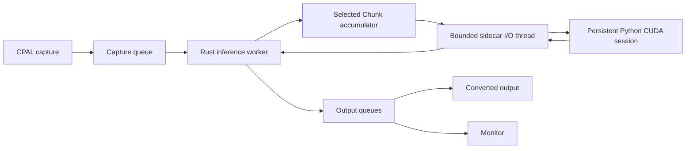
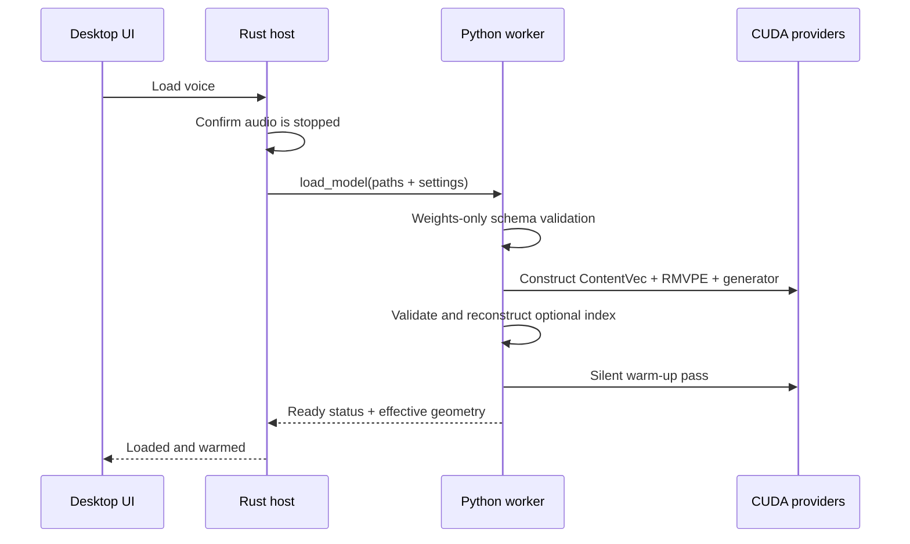
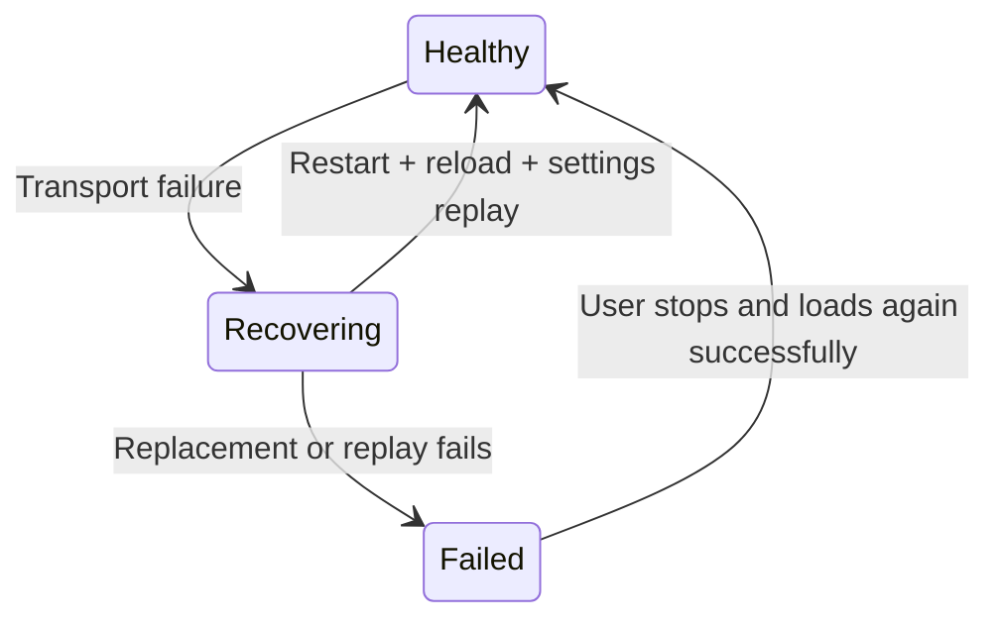

# Persistent live RVC engine

The live RVC milestone connects a resident Python/CUDA model session to the native Rust capture → inference → playback pipeline without sending audio through HTTP, Socket.IO, or browser code.

[← Documentation index](README.md)

## Outcome

VC Next can:

- import and inspect an RVC checkpoint, either directly or by scanning a bounded w-okada model folder;
- pair it with an optional FAISS `.index`;
- discover or explicitly select ContentVec assets;
- load RVC v1/v2 generators targeting 32, 40, or 48 kHz;
- warm the complete model session on CUDA, including one exact Chunk/SOLA request before reporting Ready;
- retain the session between live audio hops;
- apply pitch, speaker, retrieval, protection, F0, Chunk, and Extra settings;
- stitch streaming output with persistent SOLA state;
- recover the Python process and replay model/settings after transport failure.

The app requires audio to be stopped during model load or unload. A checkpoint must reach **Loaded and warmed** before converted audio can start.

## End-to-end ownership



The Rust inference worker submits work asynchronously and polls completed responses. Neither capture nor playback waits for Python.

## Live wire protocol

Every live frame begins with a fixed 16-byte header:

| Field | Purpose |
| --- | --- |
| Magic | Rejects unrelated or corrupted streams |
| Kind | Distinguishes JSON control, audio, error, and shutdown frames |
| Request ID | Matches responses to requests |
| Payload length | Bounds allocation and validates complete reads |

Control payloads are compact JSON. Audio payloads are little-endian mono float32 samples. The host validates response kind, identity, and output frame count before exposing samples to the inference backend.

## Model load sequence



Loading can take several seconds because CUDA contexts, ONNX providers, generator weights, indexes, and the exact live-path warm-up are initialized. This work runs off the Tauri UI thread and has a longer explicit timeout than ordinary controls.

## Supported checkpoint rates

The native live path uses 48 kHz mono PCM. The RVC generator can target:

| Checkpoint target | Live behavior |
| ---: | --- |
| 32 kHz | Generator output is resampled to 48 kHz before stitching |
| 40 kHz | Generator output is resampled to 48 kHz before stitching |
| 48 kHz | Generator output proceeds directly to alignment |

Targeted GPU verification includes a 32 kHz RVC v2 checkpoint/index pair and a 40 kHz RVC v1 checkpoint/index pair. Both loaded with FAISS retrieval and returned a 48 kHz live status.

## Feature extraction and generation

For each trailing analysis window, Python performs:

```text
48 kHz live history
  → 16 kHz feature waveform (w-okada `resampy` `kaiser_fast`)
  ├── ContentVec content features
  └── RMVPE pitch and periodicity
  → optional FAISS retrieval blend
  → RVC pitch quantization and feature interpolation
  → v1/v2 PyTorch CUDA generator
  → optional 32/40 → 48 kHz output resample (same filter)
  → SOLA candidate alignment and crossfade
  → one 48 kHz converted hop
```

All expensive model/session construction occurs during load. Per-hop work reuses the resident sessions and buffers.

## Named streaming profiles

| Preset | Chunk/hop | Analysis context | Crossfade | SOLA search |
| --- | ---: | ---: | ---: | ---: |
| Low latency | 7,680 frames / 160 ms | 19,200 / 400 ms | 4,096 / 85.3 ms | 480 / 10 ms |
| Balanced | 9,600 / 200 ms | 24,000 / 500 ms | 4,096 / 85.3 ms | 576 / 12 ms |
| Quality | 12,000 / 250 ms | 28,800 / 600 ms | 4,096 / 85.3 ms | 720 / 15 ms |

Changing a named mode resets Chunk and Extra to its defaults. Advanced settings can override them afterward.

Hardware calibration runs three steady-state requests for each named profile after a discarded warm-up request. The recommendation uses the measured p95 and maximum process times, not a single lucky sample, and restores the user's previous profile afterward.

## Custom Chunk and Extra

**Chunk** is the number of new 48 kHz samples collected before a model request. **Extra/context** is the retained analysis window used to provide past speech context. The worker also reserves at least 4,096 front-context samples for w-okada-compatible RVC generation. V1 windows are rounded to a 128-sample boundary; v2 windows follow RVCr2's 16 kHz/160-sample conversion geometry and are rounded to the equivalent 480-frame boundary at 48 kHz.

The UI currently exposes Chunk values from 3,072 frames (64 ms) through 52,800 frames (1.1 s), including common w-okada-compatible choices such as 12,288 and 49,152. Extra choices range from 3,840 frames (80 ms) through 480,000 frames (10 s).

When a package contains w-okada `params.json`, import inspection supplies
model-specific defaults for pitch, retrieval ratio, Protect ratio, Chunk, the
matching sibling index, and Hubert/ContentVec asset preference. A package using
`hubert_base_l12` follows w-okada's observed resolver and selects the canonical
`contentvec/contentvec-f.onnx` asset when both ContentVec and Rinna Hubert are
present. Explicit UI settings override imported metadata; old library entries
are migrated once if they still contain the original prototype defaults.

The engine applies safety rules:

- values must be whole frame counts within the worker's global bounds;
- crossfade and search are reduced when a small Chunk cannot hold the preset values;
- analysis is increased when Extra is too short for `Chunk + crossfade + search`;
- the effective values are reported back in worker status.

For RVCv2 voices, the worker also matches w-okada's filter boundary: every
incoming 48 kHz hop is resampled with `resampy`'s `kaiser_fast` filter before
being appended to the retained 16 kHz history. Resampling the entire retained
window on every hop changes the filter edge conditions and can make otherwise
identical checkpoints sound different at chunk boundaries.

> [!CAUTION]
> A value appearing in the selector does not mean it is appropriate for every model. Very small chunks can miss their compute deadline or destabilize pitch and boundaries; very large context increases memory, compute, and response time.

## Stateful SOLA stitching

The generator produces an analysis-window waveform, not a phase-continuous live stream. The `SolaStitcher` therefore:

1. retains the previous overlap tail;
2. searches a bounded alignment region in the new candidate;
3. chooses the highest normalized correlation offset;
4. applies an equal-power crossfade;
5. emits exactly one Chunk-sized hop;
6. stores the new overlap state.

The first converted hop is silent while the overlap state primes. This is deliberate and avoids emitting an invalid partial boundary.

## FAISS retrieval

Retrieval is optional per model. During load, the worker verifies that the index dimension matches the checkpoint feature channels:

- RVC v1 commonly uses 256 channels;
- RVC v2 commonly uses 768 channels.

The index is reconstructed once, not once per hop. By default each conversion
uses the nearest FAISS vector (`k=1`), matching the current w-okada RVC
pipeline. The retrieval helper also retains an explicit weighted-neighbor mode
for comparing older/custom RVC builds. Retrieved features are blended according
to Index retrieval, and Protect ratio preserves unvoiced consonants using the
same two-stage F0 mask as the upstream implementation.

An index ratio above zero without a loaded index is rejected with an actionable error.

## Live settings

| Setting | Range/behavior | Requires restart? |
| --- | --- | --- |
| Pitch | −50 to +50 semitones | Applied before next session; stream state reset |
| Index retrieval | 0–100% | Requires a valid loaded index above zero |
| Protect ratio | 0–50% | Used during retrieval blending |
| Speaker ID | Checkpoint-defined | Validated against speaker embeddings |
| RMVPE threshold | 0.01–0.99 (default 0.30) | Controls voiced/unvoiced detection; the default matches w-okada's RMVPE ONNX extractor |
| Preset | Quality/Balanced/Low latency | Updates default geometry |
| Chunk | Explicit frame choice | Changes request/output hop |
| Extra/context | Explicit frame choice | Changes retained analysis history |

Settings are persisted locally by model path. Imported library entries and the last selected voice are also restored locally; renaming or removing an entry never renames or deletes the source files.

## Idle-input suppression

An RVC decoder can emit a small non-zero signal for an all-zero analysis window.
That decoder bias must not become audible static while a microphone is idle. The
worker measures each normalized 48 kHz hop before feature extraction and returns
exact zeros when RMS ≤ `0.002` and the hop has no concentrated speech activity.
This covers the continuous idle hiss commonly exposed by virtual buses such as
Voicemeeter while allowing a short, quiet syllable to wake the model. Isolated
interface spikes remain suppressed because their activity ratio is negligible.
It resets the analysis
history and SOLA overlap when silence begins and again before the next voiced hop,
so stale tails cannot leak into the transition. Warm-up and calibration call the
same processing path with suppression disabled to keep their measurements honest.

Worker status exposes the Python-side thresholds and counters (`silenceSuppressedCalls`,
`lastInputRms`, `maxInputRms`, and `lastInputPeak`) for diagnosing a noise floor or an overly
quiet microphone. These are separate from the user-facing native noise-suppression
and noise-gate controls, which run earlier in the callback-safe audio path.

The native Rust route repeats a conservative whole-block backstop at `0.004` RMS
(about -48 dBFS) with the same concentrated-activity escape hatch. It clears
queued converted audio when the selected virtual input remains idle, so a
device floor that is higher than the Python hop threshold cannot turn decoder
bias into audible static during startup or sidecar recovery.

For active speech, the worker also applies w-okada's source-volume rule: it
measures the current input crop and scales generated audio by `sqrt(RMS)` before
SOLA stitching. This keeps the same model from becoming unexpectedly louder or
quieter solely because the host path used a different live buffer.

## Worker deadlines and recovery

The native host distinguishes:

- handshake timeout;
- ordinary control timeout;
- model-load/warm-up timeout;
- live-audio response timeout;
- shutdown timeout.

After a pipe or transport failure:



Rust remembers the last successful model-load parameters. Later settings calls are merged into that snapshot so the replacement worker receives the current model, index, embedder, pitch, retrieval, speaker, F0, and stream geometry.

While recovery runs, native audio remains alive and safely emits silence instead of blocking callbacks.

## Telemetry

The live status includes:

- model, index, ContentVec, and RMVPE paths;
- checkpoint version, target rate, precision, device, and speaker count;
- index type, dimension, and vector count;
- selected/effective Chunk, analysis, crossfade, and search frames;
- warm-up time and process-call count;
- last resample, content, pitch, retrieval, generator, stitch, and total times;
- last SOLA offset;
- provider names;
- worker state, restart count, and last worker error.

## Historical reference measurements

One indexed `mayaputri.pth` RVC v2 fixture on the RTX 4050 baseline produced:

| Measurement | Result |
| --- | ---: |
| Index | `IndexIVFFlat`, 34,823 × 768 |
| Low-latency geometry | 7,680 / 19,200 frames |
| Five indexed round trips | 93–125 ms |
| Five-pass average | 107 ms |
| Tested preset deadlines | All three returned within their selected hop |
| Six-hop boundary jumps | 0.0002–0.0050 peak amplitude |

These are per-request fixture measurements. They do not include every input/output buffer, device driver, virtual cable, or application buffer and therefore are not end-to-end latency claims.

## Verification

Automated Python tests cover protocol framing, stream geometry, pitch bounds, SOLA behavior, index helpers, silence gating, w-okada retrieval/front-context parity, and error handling. Rust tests cover dynamic Chunk propagation, transport framing, recovery state, and model/settings replay.

```powershell
.\engine-python\.venv\Scripts\python.exe -m unittest discover -s engine-python\tests -p "test_*.py" -v
cargo test --manifest-path src-tauri\Cargo.toml
```

On the RTX 4050 reference system, the actual `e-girl_e350_s42700.pth` plus
`added_IVF1611_Flat_nprobe_1_e-girl_v2.index` pair completed a 60-second,
120-call realtime soak with finite output, p50 109.6 ms, p95 131.8 ms, max
143.5 ms, and zero selected-hop deadline misses. The native Voicemeeter B2
idle route measured max RMS `0.00126` (below the `0.002` gate), returned exact
zero output/monitor peaks, and recorded zero audio underruns or inference
deadline misses.

## Current limitations

- The 160 ms named preset is still above the project's eventual responsiveness goal.
- Custom 64–150 ms Chunks remain experimental, but the UI can now measure the named profiles after loading a model and apply the recommended stable profile.
- RMVPE is the only connected live pitch extractor.
- Exported five-input RVC ONNX generators are connected to live inference. CUDA provider activation and low-latency performance are still validated per model; CPU fallback is reported as a warning condition rather than treated as a real-time guarantee.
- The first converted block is silent while state primes; a native idle backstop also drops a complete quiet live block before it reaches the sidecar, preventing decoder bias from becoming output static during device startup or worker recovery.
- Endpoint defaults may differ; the native boundary resamples them to the fixed 48 kHz live contract.
- A CABLE-A shared-mode passthrough run detected every impulse with zero callback warnings. The latest exact-count run detected 100/100 impulses and measured 247.7 ms P50/P95. The first real `live_route_validation.py` smoke passed 20 Quality-profile calls through VoiceMeeter input 7 to CABLE-B output 13 with zero deadline misses, callback warnings, queue drops, or output underruns (145.3 ms P50, 224.5 ms P95, 247.8 ms max). The native route has since passed a real-model idle run with zero output peak and zero XRuns, and the worker completed a 120-second realtime Balanced soak with zero deadline misses (P50 91.2 ms, P95 105.9 ms, max 154.4 ms). Physical converted-speech loopback and the multi-hour acceptance matrix remain pending.
- Worker recovery preserves the process/model contract. Device loss is detected while running and still requires an explicit audio restart after the endpoint returns.

## Next work

1. Run the harness on the native VC Next converted route and additional device profiles.
2. Run extended converted-audio soaks with worker restarts and device jitter.
3. Broaden per-model Chunk calibration and persist benchmark reports rather than exposing one universal recommendation.
4. Compare continuous rate correction with the current bounded sample-slip approach.
5. Add blind quality fixtures for pitch continuity, consonants, and chunk boundaries.

## Related documents

- [Architecture](architecture.md)
- [Python sidecar](python-sidecar.md)
- [Native audio](native-audio-spike.md)
- [Prototype targets](prototype-targets.md)
