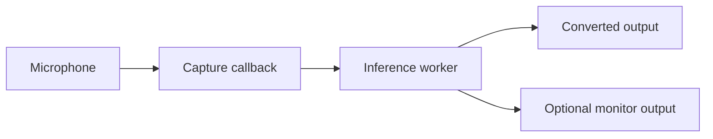
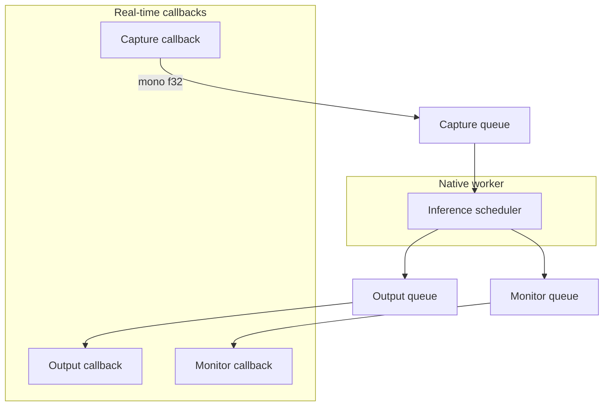

# Native audio engine

This document describes the implemented Windows audio path, its real-time constraints, stability controls, diagnostics, and remaining measurement work.

[← Documentation index](README.md)

## Outcome

VC Next owns its local capture and playback path through CPAL's WASAPI host. Browser AudioWorklets, Socket.IO, base64 PCM, and Python audio queues are not part of the local real-time loop.

The engine supports three routes:



Output and Monitor are independent Windows playback streams with separate queues, gains, clocks, meters, underrun counts, and recovery state.

## Implemented capabilities

### Device handling

- Native input/output enumeration using CPAL's WASAPI host
- Default-device detection
- Device ID, name, channel count, default rate, and sample-format reporting
- Explicit input, output, and monitor selection
- Same-device and sample-rate validation before startup
- Refresh and device-reconnection workflow while audio is stopped

### Audio conversion

- Common `f32`, `i16`, and `u16` device sample formats
- Mono downmix for inference
- Mono-to-device-channel fan-out for playback
- Validated input, output, and monitor gain
- Smoothed envelope-based input noise gate
- Transparent noise-gate off state

### Real-time isolation

- Separate capture and playback callbacks
- Fixed-capacity `ArrayQueue<f32>` buffers
- Dedicated inference worker thread
- No-op/passthrough and persistent RVC backends behind one contract
- Bounded capture backlog and converted-output queues
- Silence fallback when converted audio misses a deadline

### Stability and recovery

- Adaptive output and monitor priming
- Re-prime after underrun
- Bounded clock-drift drop/repeat correction
- Independent correction counters per playback route
- Audio-callback error retention in status
- Supervised Python model-worker recovery outside the callbacks

## Thread and queue ownership



The capture callback is the producer for the capture queue. The inference worker is its consumer and the producer for both playback queues. Each playback callback consumes only its own queue.

## Callback rules

The project treats the following as real-time rules:

- no file access;
- no model loading or CUDA initialization;
- no Python calls;
- no waiting on channels, locks, or subprocess pipes;
- no unbounded allocation;
- no formatted logging;
- bounded work proportional to the callback frame count.

Atomic counters and peaks are used for telemetry snapshots so the UI can inspect the engine without owning it.

## Capture path

For each device callback, the input path:

1. converts the device sample format to `f32`;
2. averages active input channels into mono;
3. applies input gain;
4. tracks a smoothed signal envelope;
5. applies the configured noise gate;
6. updates the input peak;
7. pushes samples into the bounded capture queue;
8. increments overrun counters when the queue is full.

The noise gate is intentionally simple and predictable. It is not a replacement for noise suppression, echo cancellation, or dereverberation.

## Inference scheduling

The native inference layer works in fixed 480-frame chunks at 48 kHz—10 ms of native scheduling granularity. The RVC adapter accumulates these frames until it reaches the selected live Chunk value, then sends that hop to the persistent Python worker asynchronously.

Telemetry records:

- inference calls;
- processed and dropped frames;
- last and maximum inference duration;
- missed native deadlines;
- active backend name and statefulness;
- configured inference Chunk.

The live RVC hop can be much larger than the native 10 ms scheduling block. This keeps audio callback work small while allowing model-specific streaming geometry.

## Playback priming

Starting playback with an empty queue creates an immediate underrun. VC Next therefore primes each output independently.

At 48 kHz:

| State | Frames | Approximate buffered time |
| --- | ---: | ---: |
| Initial target | 960 | 20 ms |
| Maximum adaptive target | 4,800 | 100 ms |

The controller starts at the lower target, raises it after underruns, and gradually settles back after a stable period. This trades a bounded amount of latency for fewer repeated dropouts on devices with scheduling jitter.

## Independent device-clock correction

Even when endpoints report the same nominal rate, their hardware clocks can drift. If the producer and consumer clocks differ slightly, queue depth eventually grows without bound or drains to zero.

VC Next performs bounded sample-slip correction:

- above the high watermark, a queued sample is dropped;
- below the low watermark, the last sample is repeated;
- corrections are counted separately for Output and Monitor;
- the adjustment is bounded so it cannot consume an arbitrary backlog in one callback.

This is currently a pragmatic stability mechanism. A continuous resampler may replace it after long-session measurements quantify the audible and latency tradeoffs.

## Audio settings

| Setting | UI range | Native behavior |
| --- | ---: | --- |
| Input gain | −24 to +24 dB | Applied before gating and capture peak measurement |
| Output gain | −24 to +12 dB | Applied to the converted/passthrough route |
| Monitor gain | −24 to +12 dB | Applied only to the optional monitor route |
| Noise gate | Off / −79 to −20 dB | Smoothed envelope gate on input |

Device selection and these settings are locked while a live session is running. Stop audio before changing the route or stream shape.

## Status and diagnostics

`AudioEngineStatus` exposes:

| Category | Examples |
| --- | --- |
| Route | device IDs/names, channels, sample rate, and engine state |
| Queue | buffer capacity, buffered frames, capture backlog, monitor backlog |
| Totals | captured, processed, played, and monitor-played frames |
| Errors | input/output/monitor overruns and underruns, last callback error |
| Stability | prime targets, reprimes, drift drops, and repeated frames |
| Inference | backend, Chunk, calls, timing, missed deadlines, dropped frames |
| Signal | input, output, and monitor peaks |
| Processing | input/output/monitor gain and gate threshold |

These values diagnose the stage that is failing. A high Python model time is different from a playback underrun, capture overrun, or monitor clock drift.

## Safe routing

> [!WARNING]
> Passthrough or converted audio can feed back immediately if it is routed to speakers near the active microphone. Use headphones for the Monitor route.

A common voice-chat route is:

```text
Physical microphone
  → VC Next Microphone
  → VC Next conversion
  → virtual cable / VoiceMeeter input
  → Discord, game chat, or OBS

VC Next Monitor
  → physical headphones
```

VC Next does not currently install its own virtual microphone driver.

## Verification

The Rust suite exercises:

- gain and gate validation;
- sample-format conversion behavior;
- inference-worker lifecycle and telemetry;
- adaptive playback priming;
- underrun-driven target growth;
- bounded drift drop/repeat correction;
- dynamic live Chunk validation;
- worker health and settings replay.

Run it with:

```powershell
cargo test --manifest-path src-tauri\Cargo.toml
```

## Known limitations

- Input, Output, and Monitor must currently report the same default sample rate.
- Shared-mode device defaults are used instead of an exclusive/event-driven Windows tuning pass.
- Sample-slip correction is not a high-quality continuous resampler.
- Bypass is represented by explicit passthrough when no model is loaded rather than a seamless in-session dry/converted crossfade.
- Hot-plug recovery requires stopping and refreshing devices.
- No acoustic echo cancellation, denoiser, dereverberation, EQ, compressor, or limiter is connected yet.

## Next measurement pass

1. Record callback block sizes and scheduling variance for representative consumer, USB, and virtual endpoints.
2. Run two-hour passthrough and converted-audio soak tests while recording all queue and correction counters.
3. Add an impulse/loopback harness for P50/P95 end-to-end latency.
4. Compare bounded sample-slip correction with a controlled asynchronous resampler.
5. Test device disconnect/reconnect recovery during an active session.
6. Tune smaller RVC hops only after callback and inference headroom are measured together.

## Related documents

- [Architecture](architecture.md)
- [Persistent live RVC](live-rvc-spike.md)
- [Prototype targets](prototype-targets.md)
