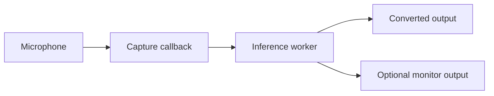
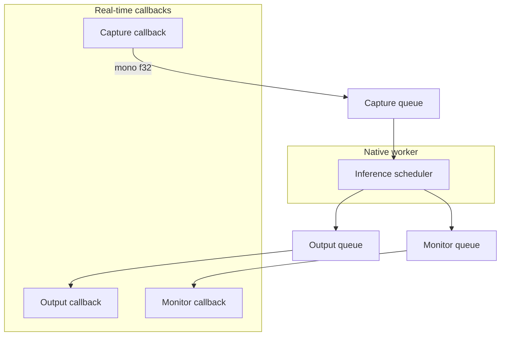

# Native audio engine

This document describes the implemented Windows audio path, its real-time constraints, stability controls, diagnostics, and remaining measurement work.

[← Documentation index](README.md)

## Outcome

VC Next owns its local capture and playback path through CPAL's WASAPI host. Browser AudioWorklets, Socket.IO, base64 PCM, and Python audio queues are not part of the local real-time loop.

The engine supports three routes:



Output and Monitor are independent Windows playback streams with separate queues, gains, clocks, meters, underrun counts, and recovery state.

## Implemented capabilities

### Device handling

- Native input/output enumeration using CPAL's WASAPI host
- Default-device detection
- Device ID, name, channel count, default rate, and sample-format reporting
- Explicit input, output, and monitor selection
- Same-device validation before startup plus bounded input/output/monitor rate conversion around the fixed 48 kHz RVC path
- Refresh before startup plus running-session endpoint detection and explicit stream restart after reconnection

### Audio conversion

- Common `f32`, `i16`, and `u16` device sample formats
- Mono downmix for inference
- Mono-to-device-channel fan-out for playback
- Validated input, output, and monitor gain
- Gentle DC/high-pass filtering before feature extraction
- Callback-safe adaptive stationary-noise suppression
- Smoothed envelope-based input noise gate
- Conservative far-end echo control using the converted output reference
- Output and monitor limiting to the float-audio range
- Transparent noise-gate off state

### Real-time isolation

- Separate capture and playback callbacks
- Fixed-capacity `ArrayQueue<f32>` buffers
- Dedicated inference worker thread
- No-op/passthrough and persistent RVC backends behind one contract
- Bounded capture backlog and converted-output queues
- Silence fallback when converted audio misses a deadline

### Stability and recovery

- Adaptive output and monitor priming
- Re-prime after underrun
- Bounded clock-drift drop/repeat correction
- Independent correction counters per playback route
- Audio-callback error retention in status
- Supervised Python model-worker recovery outside the callbacks
- Best-effort monitor startup: if Windows rejects the selected monitor
  endpoint because it is busy or its shared format changed, VC Next keeps the
  input and converted-output route alive, disables only the monitor stream,
  and reports the reason through `lastError`.

## Thread and queue ownership



The capture callback is the producer for the capture queue. The inference worker is its consumer and the producer for both playback queues. Each playback callback consumes only its own queue.

## Callback rules

The project treats the following as real-time rules:

- no file access;
- no model loading or CUDA initialization;
- no Python calls;
- no waiting on channels, locks, or subprocess pipes;
- no unbounded allocation;
- no formatted logging;
- bounded work proportional to the callback frame count.

Atomic counters and peaks are used for telemetry snapshots so the UI can inspect the engine without owning it.

## Capture path

For each device callback, the input path:

1. converts the device sample format to `f32`;
2. averages active input channels into mono;
3. applies input gain and a gentle DC/high-pass filter;
4. applies conservative far-end echo control when enabled;
5. applies adaptive stationary-noise suppression;
6. tracks a smoothed signal envelope and applies the configured noise gate;
7. updates the input peak;
8. pushes samples into the bounded capture queue;
9. increments overrun counters when the queue is full.

These processors are intentionally bounded and callback-safe. They reduce common stationary room noise and speaker bleed, but are not a replacement for a full WebRTC AEC3, RNNoise denoiser, or dereverberation system.

## Inference scheduling

The native inference layer works in fixed 480-frame chunks at 48 kHz—10 ms of native scheduling granularity. The RVC adapter accumulates these frames until it reaches the selected live Chunk value, then sends that hop to the persistent Python worker asynchronously.

Telemetry records:

- inference calls;
- processed and dropped frames;
- last and maximum inference duration;
- missed native deadlines;
- active backend name and statefulness;
- configured inference Chunk.

The live RVC hop can be much larger than the native 10 ms scheduling block. This keeps audio callback work small while allowing model-specific streaming geometry.

## Playback priming

Starting playback with an empty queue creates an immediate underrun. VC Next therefore primes each output independently.

At 48 kHz:

| State | Frames | Approximate buffered time |
| --- | ---: | ---: |
| Initial target | 1,920 | 40 ms |
| Maximum adaptive target | 4,800 | 100 ms |

On startup the host now waits for an eight-chunk cushion (3,840 frames, about
80 ms) before it starts the output stream. The steady-state controller begins
at the 40 ms target and grows only when a device actually underruns; this keeps
the normal path responsive without exposing the first CUDA/RVC warm-up as an
audible click.

The controller starts at the lower target, raises it after underruns, and gradually settles back after a stable period. This trades a bounded amount of latency for fewer repeated dropouts on devices with scheduling jitter.

## Independent device-clock correction

Even when endpoints report the same nominal rate, their hardware clocks can drift. If the producer and consumer clocks differ slightly, queue depth eventually grows without bound or drains to zero.

VC Next performs bounded sample-slip correction:

- above the high watermark, a queued sample is dropped;
- below the low watermark, the last sample is repeated;
- corrections are counted separately for Output and Monitor;
- the adjustment is bounded so it cannot consume an arbitrary backlog in one callback.

This is currently a pragmatic stability mechanism. A continuous resampler may replace it after long-session measurements quantify the audible and latency tradeoffs.

## Audio settings

| Setting | UI range | Native behavior |
| --- | ---: | --- |
| Input gain | −24 to +24 dB | Applied before gating and capture peak measurement |
| Output gain | −24 to +12 dB | Applied to the converted/passthrough route |
| Monitor gain | −24 to +12 dB | Applied only to the optional monitor route |
| Noise gate | Off / −79 to −20 dB | Smoothed envelope gate on input |
| Noise suppression | 0–100% | Adaptive downward expander for stationary noise |
| Echo control | 0–100% | Conservative NLMS cancellation from converted-output reference |
| High-pass / DC filter | Off / On | Optional gentle ~30 Hz one-pole filter; off by default for w-okada parity |

The default route is fidelity-first: high-pass, suppression, echo control, and the user noise gate are off until enabled. This avoids changing the timbre or consonant tails of a clean microphone signal while the compatibility path is being compared with w-okada.

Device selection and these settings are locked while a live session is running. Stop audio before changing the route or stream shape.

## Status and diagnostics

`AudioEngineStatus` exposes:

| Category | Examples |
| --- | --- |
| Route | device IDs/names, channels, sample rate, and engine state |
| Queue | buffer capacity, buffered frames, capture backlog, monitor backlog |
| Totals | captured, processed, played, and monitor-played frames |
| Errors | input/output/monitor overruns and underruns, last callback error |
| Stability | prime targets, reprimes, drift drops, and repeated frames |
| Inference | backend, Chunk, calls, timing, missed deadlines, dropped frames, and native silence-block suppression |
| Signal | input, output, and monitor peaks |
| Processing | input/output/monitor gain, gate, suppression, and echo strength |

These values diagnose the stage that is failing. A high Python model time is different from a playback underrun, capture overrun, or monitor clock drift.

## Safe routing

> [!WARNING]
> Passthrough or converted audio can feed back immediately if it is routed to speakers near the active microphone. Use headphones for the Monitor route.

### Windows route diagnostics

The optional `audio_validation.py` harness uses a full-duplex PortAudio stream
to measure a selected input/output pair. On Windows, select matching WASAPI
endpoints for that probe. Some WDM-KS driver pairs block while opening a
full-duplex stream even though each endpoint can be opened independently; the
harness now rejects that topology before opening it and reports the host names
instead of appearing to hang. The production native engine remains on CPAL /
WASAPI and reports a stalled route in the desktop UI when input is active but
the output peak stays idle.

The Audio setup panel also includes a bounded **Test routes** action. It plays a
quiet 440 Hz tone directly through the selected output and optional Monitor
endpoint, then reports callback frame counts, peak level, and any per-endpoint
Windows error. This verifies that a selected device can actually accept audio
without loading a model or depending on a cable loopback. The diagnostic CLI
exposes the same check with `native-route-validation --test-tone`.

A common voice-chat route is:

```text
Physical microphone
  → VC Next Microphone
  → VC Next conversion
  → virtual cable / VoiceMeeter input
  → Discord, game chat, or OBS

VC Next Monitor
  → physical headphones
```

VC Next does not currently install its own virtual microphone driver.

## Verification

The Rust suite exercises:

- gain and gate validation;
- sample-format conversion behavior;
- inference-worker lifecycle and telemetry;
- adaptive playback priming;
- underrun-driven target growth;
- bounded drift drop/repeat correction;
- dynamic live Chunk validation;
- worker health and settings replay.

Run it with:

```powershell
cargo test --manifest-path src-tauri\Cargo.toml
```

The repository also includes a native-route diagnostic that drives the same
CPAL/WASAPI streams and persistent RVC worker used by the desktop host. It is
useful for separating a real audio-engine problem from a UI or browser-preview
problem:

```powershell
# Enumerate the exact Windows endpoint IDs and names first.
npm run validate:native-route -- -List

# Run a short idle route with a real checkpoint and its matching index.
npm run validate:native-route -- `
  -ModelPath "C:\path\to\voice.pth" `
  -IndexPath "C:\path\to\voice.index" `
  -ContentVecPath "C:\path\to\contentvec-f.onnx" `
  -InputDevice "Voicemeeter Out A2" `
  -OutputDevice "CABLE-B Input" `
  -Seconds 5 -ReportPath outputs\native-route.json
```

The diagnostic follows the fidelity-first default used by the app. To compare
the optional rumble/DC cleanup path, add `-HighPass`; the JSON report records
the request as `highPassRequested` and the active route as `audioStatus.highPassEnabled`.

The report includes the selected model defaults, live-worker telemetry,
capture/output/monitor peaks, queue counts, missed inference deadlines,
underruns, bounded clock corrections, and the native
`inferenceSilenceSuppressedCalls` counter. For an empty input, a healthy route
should report an output peak of `0` and an increasing Python or native silence
counter, depending on which layer sees the device floor first. A speech fixture
should produce a non-zero output peak and should not be classified as silence.

The RTX 4050 reference checkpoint was exercised through the native route with
the package settings `Pitch +14`, `Index 0.30`, `Protect 0.50`, `Chunk 24,000`,
and `Extra 28,800`. A five-second idle run completed with zero input/output
peaks, no queue drops, no underruns, and no missed inference deadlines. This
proves the native idle/noise path; it is not a blind perceptual quality match
against w-okada. That comparison still requires recordings made from the same
input, endpoint, model, index, pitch extractor, and chunk settings.

After increasing the initial playback cushion, a 15-second idle run on the
reference Realtek USB microphone with Output and Headphone Monitor attached
reported `maxInputPeak: 0.00239`, `maxOutputPeak: 0`, `maxMonitorPeak: 0`, 30
native silence blocks, and zero output/monitor underruns or deadline misses.

The repeatable speech-loopback harness now exercises the same path with a
known FLAC fixture sent through a WASAPI virtual-cable endpoint:

```powershell
npm run validate:native-speech -- `
  -ModelPath "C:\path\to\voice.pth" `
  -IndexPath "C:\path\to\voice.index" `
  -ContentVecPath "C:\path\to\contentvec-f.onnx" `
  -FixturePath "C:\path\to\speech.flac" `
  -InputDevice "CABLE-A Output (VB-Audio Cable A)" `
  -FixtureOutputDevice "CABLE-A Input (VB-Audio Cable A)" `
  -OutputDevice "CABLE-B Input (VB-Audio Cable B)" `
  -Seconds 12 -Preset balanced -RequireSignal `
  -ReportPath outputs\native-speech-loopback.json
```

The fixture helper resolves duplicate Windows endpoint names to the WASAPI
instance instead of failing on the MME/DirectSound/WASAPI name collision, and
the harness waits for the fixture output stream's ready marker before loading
the model. `-RequireSignal` makes a speech acceptance run fail when either
the maximum captured input or converted output peak is below `-MinimumPeak`
(0.005 by default), rather than silently passing an all-zero graph. Omit that
switch for intentional idle/silence tests. The
fixture player and recorder explicitly use shared WASAPI with automatic rate
conversion, matching the production CPAL route when a 44.1 kHz cable endpoint
feeds the fixed 48 kHz RVC path. The
RTX 4050 `e-girl_e350_s42700.pth` plus its matching 62,851-vector index has
passed the persistent-worker soak with CUDA execution, a healthy worker, and
zero missed deadlines. The native route's idle and monitor-fallback checks also
complete without output underruns or inference deadline misses. The current
machine's CABLE-A playback/capture pairing did not deliver the fixture to the
capture endpoint, however, so this harness is intentionally still marked
pending for converted-speech acceptance; a non-zero worker or fixture result
must not be mistaken for end-to-end device loopback proof.

To capture the far side of a virtual cable for inspection, use the diagnostic
recorder at the endpoint's own Windows sample rate. For example, Cable B's
capture endpoint on the reference machine is 44.1 kHz even though the native
RVC path runs internally at 48 kHz:

```powershell
& .\engine-python\.venv\Scripts\python.exe `
  engine-python\tools\record_device.py `
  --device "CABLE-B Output (VB-Audio Cable B)" `
  --output outputs\native-cable-b-captured.wav `
  --seconds 16 --sample-rate 44100 --block-size 441
```

Start the recorder before `validate:native-speech` so it captures the whole
warm-up and speech window. The JSON summary reports the selected WASAPI
instance, peak, mean absolute level, and callback warnings. A peak of `0`
means the cable endpoint was silent; it is a route/VoiceMeeter bus problem,
not evidence that the RVC model generated silence. The desktop UI makes the
same distinction with its **No input signal detected** warning.

After the w-okada parity pass, the real-model Balanced worker reports
`f0Threshold: 0.30`, an explicit `extraFrames` value, and a rounded
`analysisFrames` value. `silenceFrontFeatureFrames` is calculated from the
unrounded `extraConvertSize` exactly as in w-okada, while the retained live
window includes the 16 kHz/160-sample rounding step. Final
converted-speech certification still requires a working physical or virtual
input loopback and a blind recording comparison against w-okada.

## Known limitations

- Linear rate conversion is intentionally conservative; long-session quality testing should compare it with a higher-order asynchronous resampler.
- Shared-mode device defaults are used instead of an exclusive/event-driven Windows tuning pass.
- Sample-slip correction is not a high-quality continuous resampler.
- Bypass is represented by explicit passthrough when no model is loaded rather than a seamless in-session dry/converted crossfade.
- Device hot-plug detection is implemented, but the user must reconnect the endpoint and press **Restart audio**; automatic repeated restarts are intentionally avoided.
- The connected noise and echo processors are lightweight real-time controls, not full acoustic echo cancellation, RNNoise, dereverberation, EQ, or compressor stages.

## Next measurement pass

1. Record callback block sizes and scheduling variance for representative consumer, USB, and virtual endpoints.
2. Run two-hour passthrough and converted-audio soak tests while recording all queue and correction counters.
3. Add an impulse/loopback harness for P50/P95 end-to-end latency.
4. Compare bounded sample-slip correction with a controlled asynchronous resampler.
5. Certify device disconnect/reconnect recovery during an active session across physical and virtual endpoints.
6. Tune smaller RVC hops only after callback and inference headroom are measured together.

## Related documents

- [Architecture](architecture.md)
- [Persistent live RVC](live-rvc-spike.md)
- [Prototype targets](prototype-targets.md)
