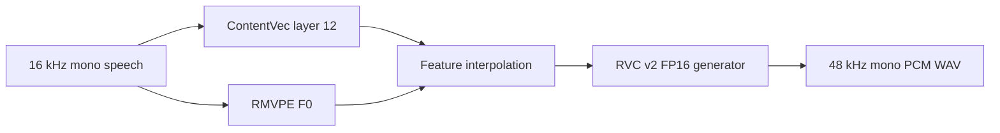

# Offline RVC compatibility proof

The offline spike established that VC Next's isolated Python environment could run a complete RVC v2 conversion on the Windows 11 / RTX 4050 reference machine before the real-time transport existed.

[← Documentation index](README.md)

> [!NOTE]
> The measurements in this document are a historical single-fixture proof, not current end-to-end live latency and not a performance guarantee for other voices or hardware.

## Question this spike answered

Before building a live audio engine, the project needed to prove that these components could execute together:

- a real RVC checkpoint;
- audited v1/v2 generator definitions;
- ContentVec ONNX feature extraction;
- RMVPE ONNX pitch extraction;
- PyTorch CUDA generator inference;
- deterministic waveform output and validation.

The proof succeeded and became the foundation for the persistent live worker.

## Pipeline



The initial proof deliberately disabled FAISS retrieval to isolate checkpoint, feature, pitch, and generator compatibility. Retrieval was added and verified later in the persistent worker.

## Representative fixture

| Item | Value |
| --- | --- |
| Checkpoint | Local `mayaputri.pth` |
| RVC format | v2 with pitch conditioning |
| Checkpoint size | 57,583,493 bytes |
| Target rate | 48 kHz |
| Feature encoder | `contentvec-f.onnx`, layer 12, 768 channels |
| Pitch extractor | `rmvpe_20231006.onnx` |
| Generator | PyTorch CUDA FP16 |
| Retrieval index | Disabled for this fixture |

The checkpoint, feature models, input recording, and converted output remain outside the repository.

## Compatibility work proven

The loader successfully performed:

1. restricted weights-only checkpoint loading;
2. RVC config and target-rate parsing;
3. v2 architecture selection;
4. removal of the unused training-only posterior encoder;
5. exact inference state-dictionary validation;
6. FP16 CUDA placement;
7. feature and pitch length alignment;
8. generator output normalization and WAV validation.

## Historical first-pass measurements

| Stage | Result |
| --- | ---: |
| Input duration | 3.00 s at 16 kHz |
| Output duration | 2.98 s at 48 kHz |
| Content extraction | 358.9 ms |
| Pitch extraction | 444.9 ms |
| Generator | 946.1 ms |
| Generator throughput | 3.15× real-time headroom for this fixture |
| One-shot process total | 8.01 s |
| Output peak | 0.733 |
| Output RMS | 0.141 |

The one-shot total included Python imports, ONNX session creation, checkpoint loading, network construction, and CUDA warm-up. That result demonstrated why model initialization had to move outside the real-time path.

## Output validation

The resulting file was checked for:

- finite samples;
- mono channel layout;
- expected duration tolerance;
- 48 kHz target rate;
- nonzero energy;
- PCM 16-bit WAV encoding.

These checks detect catastrophic output failures but do not measure speaker similarity, intelligibility, boundary quality, or subjective naturalness.

## From offline to live

The live implementation changed the ownership model:

| Offline proof | Persistent live worker |
| --- | --- |
| Process starts per conversion | Process remains alive |
| Sessions constructed per run | ContentVec, RMVPE, generator, and index remain resident |
| Whole-file waveform | Bounded streaming hops |
| No cross-hop state | Trailing analysis history and stateful SOLA |
| WAV output | Framed float32 PCM returned to Rust |
| Startup included in total | Warm-up occurs before audio starts |

The later worker also added FAISS retrieval, v1 support, 32/40 kHz generator-output resampling, custom Chunk/Extra geometry, and supervised recovery.

## Reproducing an offline conversion

After installing the Python environment:

```powershell
.\engine-python\.venv\Scripts\python.exe -m vc_next_sidecar.offline_cli `
  --input C:\path\speech.wav `
  --output C:\path\converted.wav `
  --model C:\path\voice.pth `
  --contentvec C:\path\contentvec-f.onnx `
  --rmvpe C:\path\rmvpe_20231006.onnx `
  --max-seconds 3
```

Use a short, clean, mono speech fixture first. Keep personal recordings and third-party checkpoints outside the repository.

## Provenance

The generator definitions under `engine-python/vc_next_sidecar/rvc_compat/infer_pack` are the minimal compatibility set adapted from w-okada commit `f1caf8e7c39fd0d6866202be27bf142790191a51`.

The exact source paths, upstream notices, and local modifications are recorded in:

- [RVC compatibility provenance](../engine-python/vc_next_sidecar/rvc_compat/PROVENANCE.md)
- [Upstream assessment](upstream-assessment.md)

## What this proof did not establish

- End-to-end microphone-to-output latency
- Long-session stability
- Blind subjective quality against w-okada or commercial systems
- Compatibility with every RVC checkpoint variant
- Safe operation at very small streaming hops
- Cross-platform or non-NVIDIA support

Those questions belong to the live engine and acceptance roadmap.

## Related documents

- [Python sidecar](python-sidecar.md)
- [Persistent live RVC](live-rvc-spike.md)
- [Prototype targets](prototype-targets.md)
