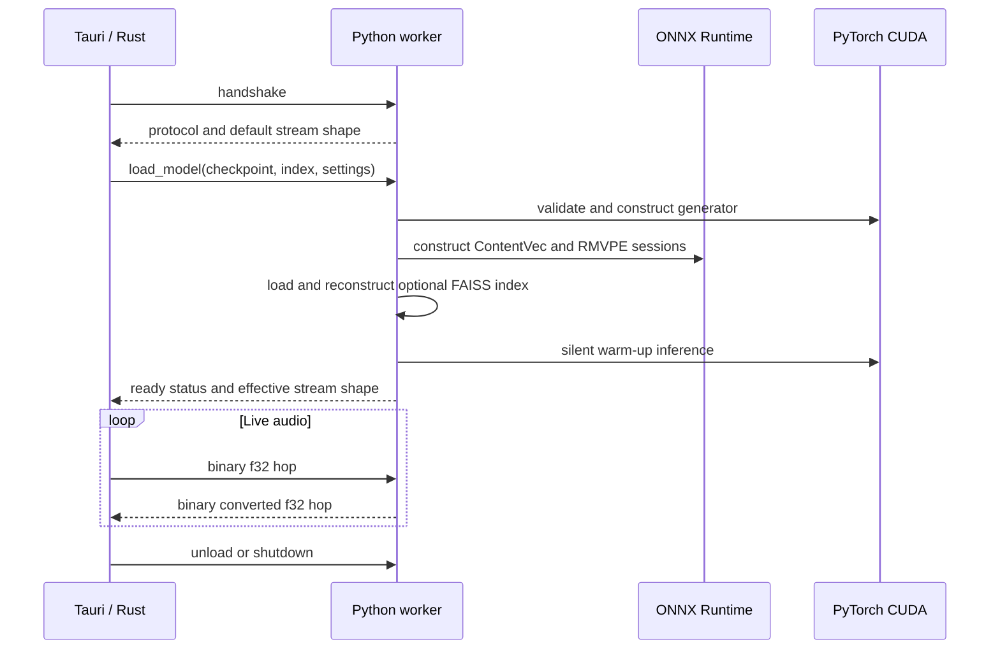

# Python compatibility sidecar

The Python sidecar is the compatibility boundary between VC Next's native desktop engine and the Python ecosystem used by RVC, PyTorch, ONNX Runtime, RMVPE, ContentVec, and FAISS.

[← Documentation index](README.md)

## Why it is a separate process

Embedding the complete Python runtime in the audio host would make dependency management, crash isolation, and future backend replacement harder. VC Next instead uses a project-local Python environment and two standard-I/O protocols.

This provides four useful boundaries:

- **Real-time:** Python never runs inside a CPAL audio callback.
- **Failure:** a stopped or wedged model worker can be restarted without killing the Tauri window.
- **Packaging:** Torch and ONNX dependencies remain isolated from Rust and Node dependencies.
- **Evolution:** the compatibility worker can later coexist with native ONNX, TensorRT, or causal streaming engines.

## Package layout

```text
engine-python/
├── pyproject.toml
├── requirements-rvc-core.txt
├── requirements-rvc-optional.txt
├── tests/
├── tools/
│   └── live_worker_smoke.py
└── vc_next_sidecar/
    ├── __main__.py
    ├── protocol.py             # JSON-line request protocol
    ├── framed_protocol.py      # persistent binary framing
    ├── runtime.py              # Python/package/CUDA probe
    ├── model_probe.py          # metadata-only inspection
    ├── checkpoint_probe.py     # trusted weights-only validation
    ├── live_worker.py          # resident model and live conversion
    ├── streaming.py            # stateful SOLA
    ├── stream_config.py        # preset/custom geometry validation
    └── rvc_compat/             # audited RVC v1/v2 compatibility code
```

## Development environment

The verified Windows/NVIDIA baseline is:

| Dependency | Version |
| --- | ---: |
| Python | 3.11.9 |
| NumPy | 1.26.4 |
| SoundFile | 0.12.1 |
| FAISS CPU | 1.14.3 |
| PyTorch | 2.9.0 + CUDA 12.8 |
| Torchaudio | 2.9.0 + CUDA 12.8 |
| ONNX Runtime GPU | 1.26.0 |

Create the environment from the repository root:

```powershell
py -3.11 -m venv engine-python/.venv
.\engine-python\.venv\Scripts\python.exe -m pip install --upgrade pip
.\engine-python\.venv\Scripts\python.exe -m pip install -e engine-python
.\engine-python\.venv\Scripts\python.exe -m pip install -r engine-python\requirements-rvc-core.txt
.\engine-python\.venv\Scripts\python.exe -m pip install torch==2.9.0 torchaudio==2.9.0 --index-url https://download.pytorch.org/whl/cu128
.\engine-python\.venv\Scripts\python.exe -m pip install -r engine-python\requirements-rvc-optional.txt
```

The Tauri host looks for the project-local interpreter before falling back to other discovery. Keeping this environment local makes runtime probing and reproduction predictable.

## Two protocols

### One-shot JSON-line protocol

Lightweight discovery commands launch Python for one request and one response:

```json
{
  "protocolVersion": 1,
  "requestId": "manual",
  "method": "probe_runtime",
  "params": {}
}
```

Try it directly:

```powershell
'{"protocolVersion":1,"requestId":"manual","method":"probe_runtime","params":{}}' |
  .\engine-python\.venv\Scripts\python.exe -m vc_next_sidecar --once
```

This protocol handles:

- Python and package capability probing;
- Torch import and synchronized CUDA execution checks;
- metadata-only model inspection;
- trusted checkpoint schema validation.

### Persistent framed protocol

Live conversion uses a long-lived process:

```powershell
.\engine-python\.venv\Scripts\python.exe -m vc_next_sidecar --worker
```

Every frame has a fixed 16-byte header containing:

- protocol magic;
- frame kind;
- request ID;
- payload byte length.

Control requests contain compact JSON. Audio requests contain little-endian mono float32 PCM. The process writes protocol responses to standard output; application diagnostics belong on standard error so they cannot corrupt the framed stream.

## Model security policy

PyTorch checkpoints have historically used pickle-backed containers. VC Next therefore treats import and load as different trust levels.

### Pass 1: metadata-only import

The first pass reads:

- normalized path and extension;
- file size and container hint;
- nearby `.index` files;
- recommended pairing information.

It does **not** instantiate a network or call unrestricted `torch.load`.

### Pass 2: trusted checkpoint validation

When a user explicitly loads a `.pth` voice, the validator uses:

```python
torch.load(path, map_location="cpu", weights_only=True)
```

It then validates:

- RVC config shape and length;
- v1/v2 feature-channel layout;
- target sample rate;
- pitch-conditioning flag;
- speaker embedding count;
- weight mapping and inference compatibility.

### Remaining trust requirement

Weights-only loading and structural validation reduce exposure, but users should still treat voice models as third-party executable-adjacent assets. Only load checkpoints from trusted sources and keep Python/Torch patched.

## Feature-model discovery

If explicit paths are not supplied, the worker searches upward from the selected checkpoint for either of these layouts:

```text
<root>/modules/contentvec/contentvec-f.onnx
<root>/modules/rmvpe/rmvpe_20231006.onnx
```

or:

```text
<root>/main/modules/contentvec/contentvec-f.onnx
<root>/main/modules/rmvpe/rmvpe_20231006.onnx
```

This allows models under both w-okada `main/model_dir/<slot>` and neighboring `voice model` folders to share the same engine assets. The import workflow can also provide an explicit ContentVec `.onnx` path.

## Live model lifecycle



The generator, feature sessions, reconstructed index vectors, streaming history, and SOLA state remain resident between audio hops.

## RVC conversion stages

Each analysis pass performs:

1. 48 kHz input resampling to 16 kHz feature rate;
2. ContentVec content-feature extraction;
3. RMVPE F0 and periodicity extraction;
4. optional FAISS nearest-neighbor retrieval;
5. v1/v2 feature preparation and pitch quantization;
6. PyTorch generator inference;
7. generator output resampling from 32/40 kHz to the 48 kHz live rate when required;
8. stateful SOLA alignment and equal-power overlap;
9. one converted hop returned to Rust.

Timing for resampling, content, pitch, retrieval, generation, stitching, and total processing is retained in worker status.

## Retrieval index handling

A selected `.index` file is loaded once during model load. The loader:

- verifies the FAISS dimension against the model feature channels;
- reconstructs the index vectors once;
- performs nearest-neighbor search for each conversion pass;
- applies inverse-distance weighting;
- handles partial IVF result rows without treating FAISS `-1` padding as valid;
- blends retrieved and original features using the configured index ratio;
- preserves unvoiced regions according to the RVC protect ratio.

An index ratio above zero is rejected when no valid index is loaded.

## Stream geometry

Named defaults are defined at 48 kHz:

| Preset | Chunk/hop | Analysis | Crossfade | SOLA search |
| --- | ---: | ---: | ---: | ---: |
| Low latency | 7,680 frames / 160 ms | 19,200 / 400 ms | 30 ms | 10 ms |
| Balanced | 9,600 / 200 ms | 24,000 / 500 ms | 40 ms | 12 ms |
| Quality | 12,000 / 250 ms | 28,800 / 600 ms | 50 ms | 15 ms |

The UI can provide explicit Chunk and Extra/context values. The worker validates them between 480 and 480,000 frames, scales overlap/search when necessary, and increases the analysis context if the requested value is too short for a complete SOLA candidate.

## Settings contract

The load/settings contract currently supports:

| Setting | Validation |
| --- | --- |
| `pitchShift` | finite value from −50 to +50 semitones |
| `indexRatio` | 0.0–1.0; requires an index above zero |
| `protectRatio` | 0.0–0.5 |
| `speakerId` | within the checkpoint speaker count |
| `f0Threshold` | 0.01–0.20 |
| `streamingPreset` | `quality`, `balanced`, or `latency` |
| `chunkFrames` | bounded whole-number frame count |
| `extraFrames` | bounded whole-number context; stitch-safe minimum enforced |

Changing settings resets streaming history to prevent old pitch, retrieval, or geometry state from leaking into the next session.

## Failure and recovery

Rust supervises the process rather than trusting it indefinitely. The host has separate handshake, control, model-load, audio, and shutdown deadlines. After a transport failure, it starts a replacement process, reloads the last successful model, reapplies merged settings, and retries the interrupted request once.

The UI reports:

- `healthy`, `recovering`, or `failed` worker state;
- restart count;
- the last worker error;
- whether a model remains resident.

## Running tests and tools

Run the complete Python suite:

```powershell
.\engine-python\.venv\Scripts\python.exe -m unittest discover -s engine-python\tests -p "test_*.py" -v
```

Run the direct live-worker smoke tool:

```powershell
.\engine-python\.venv\Scripts\python.exe engine-python\tools\live_worker_smoke.py --help
```

Run an offline conversion:

```powershell
.\engine-python\.venv\Scripts\python.exe -m vc_next_sidecar.offline_cli `
  --input .\input.wav `
  --output .\output.wav `
  --model C:\path\voice.pth `
  --contentvec C:\path\contentvec-f.onnx `
  --rmvpe C:\path\rmvpe_20231006.onnx `
  --max-seconds 3
```

## Current limitations

- The verified runtime is Windows/NVIDIA with CUDA.
- RMVPE is the only connected live F0 extractor.
- The worker consumes mono 48 kHz live PCM even when the generator targets another output rate.
- RVC `.onnx` live inference is not connected.
- The project does not redistribute checkpoints, ContentVec, RMVPE, or user indexes.
- Packaging the full Python/CUDA environment into an installer remains future work.

## Related documents

- [Architecture](architecture.md)
- [Offline RVC proof](offline-rvc-spike.md)
- [Persistent live RVC](live-rvc-spike.md)
- [RVC source provenance](../engine-python/vc_next_sidecar/rvc_compat/PROVENANCE.md)
